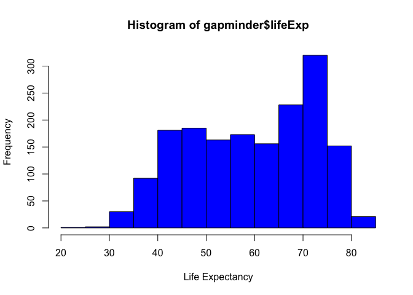
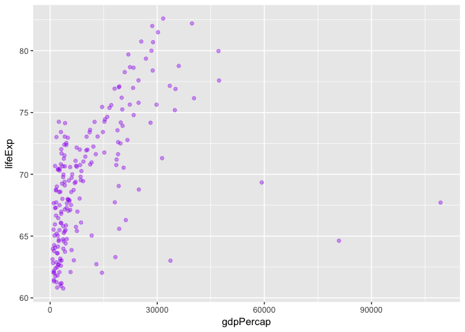

# hw02
Aisha Uduman  
September 19, 2017  

# Homework 2: Exploring Gapminder

## Bringing Rectangular Data 


```r
library(gapminder)
library(tidyverse)
```

```
## Loading tidyverse: ggplot2
## Loading tidyverse: tibble
## Loading tidyverse: tidyr
## Loading tidyverse: readr
## Loading tidyverse: purrr
## Loading tidyverse: dplyr
```

```
## Conflicts with tidy packages ----------------------------------------------
```

```
## filter(): dplyr, stats
## lag():    dplyr, stats
```

## Exploring the Gapminder object 


#### 1. Is it a data frame, matrix, vector or list? 


```r
typeof(gapminder)
```

```
## [1] "list"
```

```r
class(gapminder)
```

```
## [1] "tbl_df"     "tbl"        "data.frame"
```

Gapminder is a data frame and a list. 

#### 2. What's its class?


```r
class(gapminder)
```

```
## [1] "tbl_df"     "tbl"        "data.frame"
```

Gapminder's class is a dataframe, and a "tibble".  


#### 3. How many variables/columns?


```r
ncol(gapminder)
```

```
## [1] 6
```

```r
length(gapminder)
```

```
## [1] 6
```

Both the ncol and the length functions tell us that there are 6 variables/columns.  

#### 4. How many rows/observations?


```r
nrow(gapminder)
```

```
## [1] 1704
```

There are 1704 rows/observations

#### 5. Can you get these facts about extent or size in more than one way? Can you imagine different functions being useful in different contexts? 


Yes, there is more than on way to get facts about extent or size. Maybe the speed of computation varies between these different methods, so depending on your dataset one method may be favoured(?). I have no idea if that's true or not - I am super new to this! 

For example, we can use the dim function which you can see displays the number of rows (1704) and columns (6). 


```r
dim(gapminder)
```

```
## [1] 1704    6
```

We can also use str to find out the names of the columns, class and type of each variable (i.e. we can see that country and continent variables are factors, year and population variables are integers, and life expectancy and GDP per capita are numbers.) 


```r
str(gapminder)
```

```
## Classes 'tbl_df', 'tbl' and 'data.frame':	1704 obs. of  6 variables:
##  $ country  : Factor w/ 142 levels "Afghanistan",..: 1 1 1 1 1 1 1 1 1 1 ...
##  $ continent: Factor w/ 5 levels "Africa","Americas",..: 3 3 3 3 3 3 3 3 3 3 ...
##  $ year     : int  1952 1957 1962 1967 1972 1977 1982 1987 1992 1997 ...
##  $ lifeExp  : num  28.8 30.3 32 34 36.1 ...
##  $ pop      : int  8425333 9240934 10267083 11537966 13079460 14880372 12881816 13867957 16317921 22227415 ...
##  $ gdpPercap: num  779 821 853 836 740 ...
```

We can also use summary to see the number of variables (columns), the mean, median, minimum and maximum of each variable and their names. 


```r
summary(gapminder)
```

```
##         country        continent        year         lifeExp     
##  Afghanistan:  12   Africa  :624   Min.   :1952   Min.   :23.60  
##  Albania    :  12   Americas:300   1st Qu.:1966   1st Qu.:48.20  
##  Algeria    :  12   Asia    :396   Median :1980   Median :60.71  
##  Angola     :  12   Europe  :360   Mean   :1980   Mean   :59.47  
##  Argentina  :  12   Oceania : 24   3rd Qu.:1993   3rd Qu.:70.85  
##  Australia  :  12                  Max.   :2007   Max.   :82.60  
##  (Other)    :1632                                                
##       pop              gdpPercap       
##  Min.   :6.001e+04   Min.   :   241.2  
##  1st Qu.:2.794e+06   1st Qu.:  1202.1  
##  Median :7.024e+06   Median :  3531.8  
##  Mean   :2.960e+07   Mean   :  7215.3  
##  3rd Qu.:1.959e+07   3rd Qu.:  9325.5  
##  Max.   :1.319e+09   Max.   :113523.1  
## 
```

We can us the as_tibble() function to see the number of columns and their names, number of rows and data type of each variable. 


```r
as_tibble(gapminder)
```

```
## # A tibble: 1,704 x 6
##        country continent  year lifeExp      pop gdpPercap
##         <fctr>    <fctr> <int>   <dbl>    <int>     <dbl>
##  1 Afghanistan      Asia  1952  28.801  8425333  779.4453
##  2 Afghanistan      Asia  1957  30.332  9240934  820.8530
##  3 Afghanistan      Asia  1962  31.997 10267083  853.1007
##  4 Afghanistan      Asia  1967  34.020 11537966  836.1971
##  5 Afghanistan      Asia  1972  36.088 13079460  739.9811
##  6 Afghanistan      Asia  1977  38.438 14880372  786.1134
##  7 Afghanistan      Asia  1982  39.854 12881816  978.0114
##  8 Afghanistan      Asia  1987  40.822 13867957  852.3959
##  9 Afghanistan      Asia  1992  41.674 16317921  649.3414
## 10 Afghanistan      Asia  1997  41.763 22227415  635.3414
## # ... with 1,694 more rows
```


#### 6. What data type is each variable? 

We can use sapply(gapminder, class), class(gapminder$variable) to see the data type of each variable. 


```r
sapply(gapminder,class)
```

```
##   country continent      year   lifeExp       pop gdpPercap 
##  "factor"  "factor" "integer" "numeric" "integer" "numeric"
```


```r
class(gapminder$country)
```

```
## [1] "factor"
```

```r
class(gapminder$continent)
```

```
## [1] "factor"
```

```r
class(gapminder$year)
```

```
## [1] "integer"
```

```r
class(gapminder$lifeExp)
```

```
## [1] "numeric"
```

```r
class(gapminder$pop)
```

```
## [1] "integer"
```

```r
class(gapminder$gdpPercap)
```

```
## [1] "numeric"
```

Classes are as follows:
* country = factor
* continent = factor 
* year = integer 
* lifeExp = numeric (double)
* pop = integer 
* gdpPercap = numeric (double)


## Exploring individual variables 

#### 1. Pick one categorical variable (country) and at least one quantitative variable (gdpPercap) to explore. What are the possible values or range of each variable? What is the distribution? 

**Categorical variable I chose is country:** 


```r
summary(gapminder$country)
```

```
##              Afghanistan                  Albania                  Algeria 
##                       12                       12                       12 
##                   Angola                Argentina                Australia 
##                       12                       12                       12 
##                  Austria                  Bahrain               Bangladesh 
##                       12                       12                       12 
##                  Belgium                    Benin                  Bolivia 
##                       12                       12                       12 
##   Bosnia and Herzegovina                 Botswana                   Brazil 
##                       12                       12                       12 
##                 Bulgaria             Burkina Faso                  Burundi 
##                       12                       12                       12 
##                 Cambodia                 Cameroon                   Canada 
##                       12                       12                       12 
## Central African Republic                     Chad                    Chile 
##                       12                       12                       12 
##                    China                 Colombia                  Comoros 
##                       12                       12                       12 
##         Congo, Dem. Rep.              Congo, Rep.               Costa Rica 
##                       12                       12                       12 
##            Cote d'Ivoire                  Croatia                     Cuba 
##                       12                       12                       12 
##           Czech Republic                  Denmark                 Djibouti 
##                       12                       12                       12 
##       Dominican Republic                  Ecuador                    Egypt 
##                       12                       12                       12 
##              El Salvador        Equatorial Guinea                  Eritrea 
##                       12                       12                       12 
##                 Ethiopia                  Finland                   France 
##                       12                       12                       12 
##                    Gabon                   Gambia                  Germany 
##                       12                       12                       12 
##                    Ghana                   Greece                Guatemala 
##                       12                       12                       12 
##                   Guinea            Guinea-Bissau                    Haiti 
##                       12                       12                       12 
##                 Honduras         Hong Kong, China                  Hungary 
##                       12                       12                       12 
##                  Iceland                    India                Indonesia 
##                       12                       12                       12 
##                     Iran                     Iraq                  Ireland 
##                       12                       12                       12 
##                   Israel                    Italy                  Jamaica 
##                       12                       12                       12 
##                    Japan                   Jordan                    Kenya 
##                       12                       12                       12 
##         Korea, Dem. Rep.              Korea, Rep.                   Kuwait 
##                       12                       12                       12 
##                  Lebanon                  Lesotho                  Liberia 
##                       12                       12                       12 
##                    Libya               Madagascar                   Malawi 
##                       12                       12                       12 
##                 Malaysia                     Mali               Mauritania 
##                       12                       12                       12 
##                Mauritius                   Mexico                 Mongolia 
##                       12                       12                       12 
##               Montenegro                  Morocco               Mozambique 
##                       12                       12                       12 
##                  Myanmar                  Namibia                    Nepal 
##                       12                       12                       12 
##              Netherlands              New Zealand                Nicaragua 
##                       12                       12                       12 
##                    Niger                  Nigeria                   Norway 
##                       12                       12                       12 
##                     Oman                 Pakistan                   Panama 
##                       12                       12                       12 
##                  (Other) 
##                      516
```

```r
str(gapminder)
```

```
## Classes 'tbl_df', 'tbl' and 'data.frame':	1704 obs. of  6 variables:
##  $ country  : Factor w/ 142 levels "Afghanistan",..: 1 1 1 1 1 1 1 1 1 1 ...
##  $ continent: Factor w/ 5 levels "Africa","Americas",..: 3 3 3 3 3 3 3 3 3 3 ...
##  $ year     : int  1952 1957 1962 1967 1972 1977 1982 1987 1992 1997 ...
##  $ lifeExp  : num  28.8 30.3 32 34 36.1 ...
##  $ pop      : int  8425333 9240934 10267083 11537966 13079460 14880372 12881816 13867957 16317921 22227415 ...
##  $ gdpPercap: num  779 821 853 836 740 ...
```

There are 142 possible values for 'Countries', each one having 12 entries. The possible values (names of all countries) can be seen by calling on a summary, and if you use the str function you can see the number of factors (number of countires) being 142, but not all their names. I'm not sure how to describe the range of countries...if we plot it you would see a uniform distribution as each country as 12 values, which isn't very informative at all.  


```r
table(gapminder$country)
```

```
## 
##              Afghanistan                  Albania                  Algeria 
##                       12                       12                       12 
##                   Angola                Argentina                Australia 
##                       12                       12                       12 
##                  Austria                  Bahrain               Bangladesh 
##                       12                       12                       12 
##                  Belgium                    Benin                  Bolivia 
##                       12                       12                       12 
##   Bosnia and Herzegovina                 Botswana                   Brazil 
##                       12                       12                       12 
##                 Bulgaria             Burkina Faso                  Burundi 
##                       12                       12                       12 
##                 Cambodia                 Cameroon                   Canada 
##                       12                       12                       12 
## Central African Republic                     Chad                    Chile 
##                       12                       12                       12 
##                    China                 Colombia                  Comoros 
##                       12                       12                       12 
##         Congo, Dem. Rep.              Congo, Rep.               Costa Rica 
##                       12                       12                       12 
##            Cote d'Ivoire                  Croatia                     Cuba 
##                       12                       12                       12 
##           Czech Republic                  Denmark                 Djibouti 
##                       12                       12                       12 
##       Dominican Republic                  Ecuador                    Egypt 
##                       12                       12                       12 
##              El Salvador        Equatorial Guinea                  Eritrea 
##                       12                       12                       12 
##                 Ethiopia                  Finland                   France 
##                       12                       12                       12 
##                    Gabon                   Gambia                  Germany 
##                       12                       12                       12 
##                    Ghana                   Greece                Guatemala 
##                       12                       12                       12 
##                   Guinea            Guinea-Bissau                    Haiti 
##                       12                       12                       12 
##                 Honduras         Hong Kong, China                  Hungary 
##                       12                       12                       12 
##                  Iceland                    India                Indonesia 
##                       12                       12                       12 
##                     Iran                     Iraq                  Ireland 
##                       12                       12                       12 
##                   Israel                    Italy                  Jamaica 
##                       12                       12                       12 
##                    Japan                   Jordan                    Kenya 
##                       12                       12                       12 
##         Korea, Dem. Rep.              Korea, Rep.                   Kuwait 
##                       12                       12                       12 
##                  Lebanon                  Lesotho                  Liberia 
##                       12                       12                       12 
##                    Libya               Madagascar                   Malawi 
##                       12                       12                       12 
##                 Malaysia                     Mali               Mauritania 
##                       12                       12                       12 
##                Mauritius                   Mexico                 Mongolia 
##                       12                       12                       12 
##               Montenegro                  Morocco               Mozambique 
##                       12                       12                       12 
##                  Myanmar                  Namibia                    Nepal 
##                       12                       12                       12 
##              Netherlands              New Zealand                Nicaragua 
##                       12                       12                       12 
##                    Niger                  Nigeria                   Norway 
##                       12                       12                       12 
##                     Oman                 Pakistan                   Panama 
##                       12                       12                       12 
##                 Paraguay                     Peru              Philippines 
##                       12                       12                       12 
##                   Poland                 Portugal              Puerto Rico 
##                       12                       12                       12 
##                  Reunion                  Romania                   Rwanda 
##                       12                       12                       12 
##    Sao Tome and Principe             Saudi Arabia                  Senegal 
##                       12                       12                       12 
##                   Serbia             Sierra Leone                Singapore 
##                       12                       12                       12 
##          Slovak Republic                 Slovenia                  Somalia 
##                       12                       12                       12 
##             South Africa                    Spain                Sri Lanka 
##                       12                       12                       12 
##                    Sudan                Swaziland                   Sweden 
##                       12                       12                       12 
##              Switzerland                    Syria                   Taiwan 
##                       12                       12                       12 
##                 Tanzania                 Thailand                     Togo 
##                       12                       12                       12 
##      Trinidad and Tobago                  Tunisia                   Turkey 
##                       12                       12                       12 
##                   Uganda           United Kingdom            United States 
##                       12                       12                       12 
##                  Uruguay                Venezuela                  Vietnam 
##                       12                       12                       12 
##       West Bank and Gaza              Yemen, Rep.                   Zambia 
##                       12                       12                       12 
##                 Zimbabwe 
##                       12
```

```r
barplot(table(gapminder$country))
```

<!-- -->

**Quantitative variable I chose is life expectancy:** 


```r
summary(gapminder$lifeExp)
```

```
##    Min. 1st Qu.  Median    Mean 3rd Qu.    Max. 
##   23.60   48.20   60.71   59.47   70.85   82.60
```

This is easier to describe: we can see life expectancy is between 23.60 - 82.60. The minimum and maximum life expectancy was found using the filter function: Rwanda has the lowest life expectancy (23.60) and Japan has the highest (82.60).  The range would therefore be 59 years. 


```r
filter(gapminder, lifeExp<24)
```

```
## # A tibble: 1 x 6
##   country continent  year lifeExp     pop gdpPercap
##    <fctr>    <fctr> <int>   <dbl>   <int>     <dbl>
## 1  Rwanda    Africa  1992  23.599 7290203  737.0686
```

```r
filter(gapminder, lifeExp>82.5)
```

```
## # A tibble: 1 x 6
##   country continent  year lifeExp       pop gdpPercap
##    <fctr>    <fctr> <int>   <dbl>     <int>     <dbl>
## 1   Japan      Asia  2007  82.603 127467972  31656.07
```


Typical values can be found using the following functions:  


```r
summary(gapminder$lifeExp)
```

```
##    Min. 1st Qu.  Median    Mean 3rd Qu.    Max. 
##   23.60   48.20   60.71   59.47   70.85   82.60
```

```r
sd(gapminder$lifeExp)
```

```
## [1] 12.91711
```

```r
hist(gapminder$lifeExp, col = "blue", xlab = "Life Expectancy")
```

<!-- -->

The average (mean) life expectancy is 60.71 years, and the standard deviation is 12.92 years. The data is quite spread, which makes sense, and we assume the values are weighted in the 47.80 years - 73.63 years range, as this is the range that is 1 standard deviation from the mean. A histogram can display these characteristics, though the general distribution is a bit unexpected (notice the increase on the right for the 65-75 years). Maybe, in this case, mean is not the best way to determine average life expectancy?  


## Explore various plot types 

**A scatterplot of two quantitative variables**

I chose to do a scatterplot of population vs life expectancy. One way is to do a simple plot: 


```r
plot(gapminder$pop, gapminder$lifeExp)
```

<!-- -->

However I found this doesn't tell us much, when most of the data is concentrated in the lower population ranges. We need to lox the x axis, and use ggplot to display this more effectively (or at least give more information). 


```r
pop.lifeExp <- ggplot(gapminder, aes(x=log10(pop), y=lifeExp))
pop.lifeExp + geom_point(alpha=0.25, colour="purple")
```

<!-- -->


This doesn't tell me a whole lot either...I tried again using year and life expectancy to see how that is changing over time. 


```r
year.gdp <- ggplot(gapminder, aes(x=year, y=gdpPercap))
year.gdp + geom_point(alpha = 0.30, colour = "purple")
```

<!-- -->

I'm not sure if this was the best way to do this, but it shows that GDP per capita is slowly increasing with time. 


**A plot of one quantitative variable. Maybe a histogram or densityplot or frequency polygon**

Plotting the quantitative variable life expectancy: I tried using a density plot (which took me longer than I'm proud of), which basically looks like a rounded version of the histogram for life expectancy. I couldn't figure out how to add colour to this. 


```r
ggplot(gapminder, aes(x=lifeExp), colour = "purple") + geom_density()
```

<!-- -->

I found a resource on ggplot online and figured out how to make each continent a different colour. This shows more information about the variability between continents within this same density plot. 


```r
ggplot (gapminder, aes(x=(lifeExp), colour=continent)) + geom_density()
```

<!-- -->


**A plot of one quantitative variable and one categorical. Maybe boxplots for several continents or countries**

Use filter(), select() and %>%

Practice piping together filter() and select(). Possibly even piping into ggplot().

Plotting Chile's GDP per capita: 

First I create a filter with just the information for Chile: 


```r
chile <- filter(gapminder, country=="Chile")
```

Next I use ggplot to plot this information, specifically Chile's GDP per capita over time. I used a geom_line as this seems more visually appropriate to see a general trend.  


```r
p <- ggplot(chile, aes(x=year, y=gdpPercap))
p + geom_line()
```

<!-- -->

This is a plot of two quantitative variables (GDP per capita and year) using Chile as an example. We can see from the graph that Chile's GDP per capita is increasing over time, quite drastically in the last 30 years. 

**Trying again:**

Countries in Asia whose mean life expectancies are above the world average (60.71) and their mean GDP per capitas graphed: 


```r
gapminder %>% filter(continent=="Asia", lifeExp>60.71) %>% select(gdpPercap, lifeExp) %>% ggplot(aes(x=gdpPercap, y=lifeExp)) + geom_point(alpha=0.40, colour = "purple")
```

<!-- -->

I decided to log the x axis (GDP per capita) because is it exponential and was not visually informative left as is.


```r
gapminder %>% filter(continent=="Asia", lifeExp>60.71) %>% select(gdpPercap, lifeExp) %>% ggplot(aes(x=log10(gdpPercap), y=lifeExp)) + geom_point(alpha=0.40, colour = "purple")
```

<!-- -->

**Another example** 

Using %>%, filter and select to see how population changed between 1952 and 1997 in Zambia. 


```r
p5 <- gapminder %>% 
    filter(country %in% c("Zambia"), 
           year <= 1997, year >= 1952) %>% 
    select(country, year, pop)
```


```r
p6 <- ggplot(p5, aes(x=year, y=pop))
p6 + geom_line()
```

<!-- -->

This was taken from the class notes and amended. We can see that between the time interval selected, the population of Zambia has been on a steadily upwards trend. 


## Reporting

This took me much longer than Homework 1, which is expected as it goes into concepts in much more detail. I found the class on piping went a bit over my head, so I had to do some readings and use some online resources to better understand the syntax. This is definitely very new to me and I need to keep constantly referring back to notes/online resources/tutorials. I actually completed about 8 or 9 Swirl modules over the weekend to wrap my head around some of the basics which I maybe didn't totally understand in the first few weeks of this class. I found it really helped, and also helped me answer the first part of this homework (exploring the gapminder object). 

I found I spent a really long time on this homework, and didn't want to overcomplicate things by trying the additional section just yet. Maybe after a few more classes or a bit more practice as I'm still getting the hang of this! 

**Some problems I encountered**

- Colouring my density plot (still can't figure out how).
- Not getting confused when assigning names to a dataset and then plotting it (sounds stupid but I kept forgetting to name things memorably)
- Pushing my github doc...
- It took me a really, really, really, really long time to get the graph of the countires  in Asia whose mean life expectancies are above 60.71 vs. GDP per capita to work. I went over the class notes and got some help online as well, and finally got it to work! Initially I made the mistake of trying to add the geom_point within the penultimate level, and then realised I didn't properly understand the process of piping. I re-read the class notes and also looked at [this website](http://seananderson.ca/2014/09/13/dplyr-intro.html) to help. 
