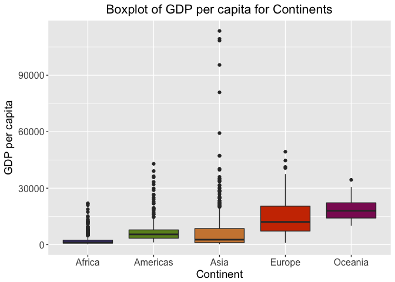
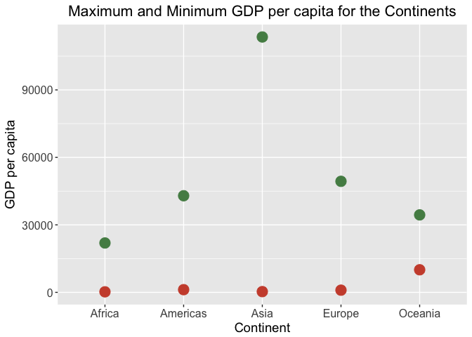
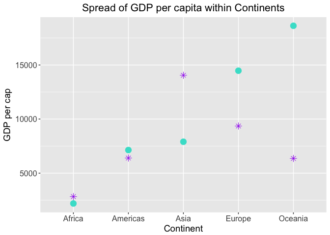
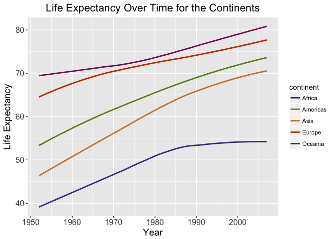
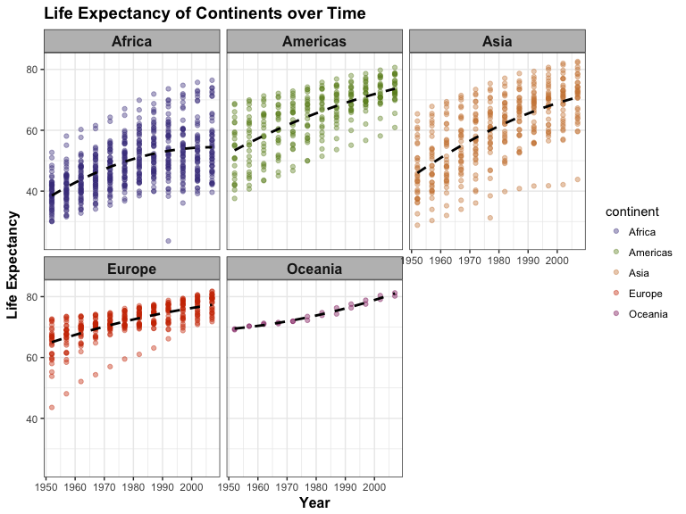

hw03\_ggplot\_dplyr
================
Aisha Uduman
October 2, 2017

Homework 3: Using dplyr and ggplot2 to manipulate and explore data
==================================================================

I will be exploring the Gapminder dataset and completing some tasks in order to manipulate (using dplyr) and visualize (using ggplot2) this data.

First I will load the Gapminder dataset, tidyverse package:

``` r
suppressPackageStartupMessages(library(tidyverse))
suppressPackageStartupMessages(library(gapminder))
suppressPackageStartupMessages(library(knitr))
```

Task 1: Get the maximum and minimum of GDP per capita for all continents
------------------------------------------------------------------------

To do this, I first grouped the gapminder data by continent using the `group_by` function. Then, I summarized the data based on what we're interested in finding: the minimum and maximum GDP per capita. Below is the code and the table of results:

``` r
task1 <- gapminder %>% 
  group_by(continent) %>% 
  summarize(min_gdpPercap = min(gdpPercap), max_gdpPercap = max(gdpPercap))
knitr::kable(task1)
```

| continent |  min\_gdpPercap|  max\_gdpPercap|
|:----------|---------------:|---------------:|
| Africa    |        241.1659|        21951.21|
| Americas  |       1201.6372|        42951.65|
| Asia      |        331.0000|       113523.13|
| Europe    |        973.5332|        49357.19|
| Oceania   |      10039.5956|        34435.37|

I'm not sure what the knitr::kable did, as it didn't make the table any more visually pleasing to look at.

``` r
knitr::kable(task1, digits=2)
```

| continent |  min\_gdpPercap|  max\_gdpPercap|
|:----------|---------------:|---------------:|
| Africa    |          241.17|        21951.21|
| Americas  |         1201.64|        42951.65|
| Asia      |          331.00|       113523.13|
| Europe    |          973.53|        49357.19|
| Oceania   |        10039.60|        34435.37|

Something I need to investigate further. I didn't notice a difference in the output visually, however I read in the kable documentation that there is an argument for "digits". I tried using this and was able to make the output a table to 2 decimal places.

#### Visualization

I thought using a boxplot would be a good option to visualise these results, as a bar graph wouldn't be able to distinguish the data appropriately (i.e. it would just be one bar per continent, minimum GDP per capita to maximum GDP per capita). I wanted a plot that would visualise the range of GDP per capita for each continent.

``` r
ggplot(gapminder, aes(continent, gdpPercap, fill=continent)) +
  geom_boxplot() +
  scale_fill_manual(values=c("darkslateblue", "olivedrab", "tan3", "orangered3", "maroon4")) + 
  labs(x = "Continent", y = "GDP per capita", title = "Boxplot of GDP per capita for Continents") + 
  theme(legend.position = "none",
        axis.title = element_text(size=14),
        axis.text.x = element_text(size=12),
        axis.text.y = element_text(size=12),
        plot.title = element_text(size=16, hjust = 0.5))
```



The boxplot is decent, however I don't think the take-home information is as clear as it could be. This is likely due to the huge range of GDP per capita in the continent of Asia. In terms of visualization, I found some colour codes online (link is below) and I decided to leave the legend out as it's self-explanatory that each continent is coloured separately.

I then thought it would be good to try and use ggplot to plot both the minimum and the maximum GDP per capita points for each continent. The minimum could be one colour and the maximum could be a different colour so we can distinguish more easily between the continents. This took me a while but I think I figured it out:

``` r
ggplot(task1, aes(x=continent)) +
  geom_point(aes(y=min_gdpPercap), colour = "tomato3", size = 5) +
  geom_point(aes(y=max_gdpPercap), colour = "palegreen4", size = 5) +
  labs(y = "GDP per capita", x = "Continent", title = "Maximum and Minimum GDP per capita for the Continents") + 
  theme(axis.title = element_text(size=14),
        axis.text.x = element_text(size=12),
        axis.text.y = element_text(size=12),
        plot.title = element_text(size=16, hjust = 0.5))
```



I think this is a much better way to visualize the minimum and maximum GDP per capita between each continent. I used the `labs` function we went over in class to label the y-axis to "GDP per capita", the x-axis to "Continent" and to make a title for the plot. However, it might be more informative to display this information in the form of a bar plot, where each continent has a minimum and maximum...I wasn't able to figure out how to do this (i.e. graphing 2 variables per continent).

The output shows us that Asia has the highest GDP per capita out of the continents. I was interested in finding out which country specifically had the highest GDP corresponding to the green maximum. From the initial table, I thought it would be interesting to see which countries in Asia have a higher GDP per capita than the maximum GDP per capita of Europe (which is ~50000).

``` r
gapminder %>% filter(continent=="Asia", gdpPercap>50000)
```

    ## # A tibble: 6 x 6
    ##   country continent  year lifeExp     pop gdpPercap
    ##    <fctr>    <fctr> <int>   <dbl>   <int>     <dbl>
    ## 1  Kuwait      Asia  1952  55.565  160000 108382.35
    ## 2  Kuwait      Asia  1957  58.033  212846 113523.13
    ## 3  Kuwait      Asia  1962  60.470  358266  95458.11
    ## 4  Kuwait      Asia  1967  64.624  575003  80894.88
    ## 5  Kuwait      Asia  1972  67.712  841934 109347.87
    ## 6  Kuwait      Asia  1977  69.343 1140357  59265.48

From this we can see that [Kuwait](https://en.wikipedia.org/wiki/Economy_of_Kuwait) has a very high GDP per capita and is likely a reason why the distribution of Asian GDP per capitas is so large. Kuwait has nearly 10% of the global oil reserves which accounts for nearly half of the country's GDP, and about 95% of export revenue and government income. With a fairly low population, this means its GDP per capita is consistently high.

Task 2: Look at the spread of GDP per capita within the continents
------------------------------------------------------------------

To look at 'spread', I decided to look at the mean, minimum, maximum and standard deviation of GDP per capita within the continents.

``` r
task2 <- gapminder %>%
  group_by(continent) %>% 
  summarize(mean_gdp = mean(gdpPercap), 
            min_gdp = min(gdpPercap), 
            max_gdp = max(gdpPercap), 
            sd_gdp = sd(gdpPercap))  
knitr::kable(task2, digits=2)
```

| continent |  mean\_gdp|  min\_gdp|   max\_gdp|   sd\_gdp|
|:----------|----------:|---------:|----------:|---------:|
| Africa    |    2193.75|    241.17|   21951.21|   2827.93|
| Americas  |    7136.11|   1201.64|   42951.65|   6396.76|
| Asia      |    7902.15|    331.00|  113523.13|  14045.37|
| Europe    |   14469.48|    973.53|   49357.19|   9355.21|
| Oceania   |   18621.61|  10039.60|   34435.37|   6358.98|

This gives us our information which we will now plot.

#### Visualization

``` r
gapminder %>% 
  ggplot(aes(x=continent, y=gdpPercap)) + 
  geom_boxplot(aes(fill = continent), show.legend = FALSE) + 
  scale_fill_manual(values=c("darkslateblue", "olivedrab", "tan3", "orangered3", "maroon4")) +
  labs(x = "Country", y = "GDP per capita", title = "Spread of GDP per capita Within Continents") + 
  theme(axis.title = element_text(size=14),
        axis.text.x = element_text(size=12),
        axis.text.y = element_text(size=12),
        plot.title = element_text(size=16, hjust = 0.5))
```


This is essentially the same as the initial boxplot I made in Task 1. We can see that Asia has the largest spread, however I think there is a better way to visualize the information made in the initial dataframe for this task: Instead of including the mean, minimum, maximum and standard deviation, I think it would be more useful to show the mean and standard deviation:

``` r
gapminder %>%
  group_by(continent) %>% 
  summarize(mean_gdp = mean(gdpPercap), sd_gdp = sd(gdpPercap)) %>% 
  ggplot(aes(x = continent)) +
  geom_point(aes(y = mean_gdp), colour = "turquoise", size = 4) + 
  geom_point(aes(y = sd_gdp), colour = "purple", shape = 8, size = 3) + 
  labs(x = "Continent", y = "GDP per cap", title = "Spread of GDP per capita within Continents") +
  theme(axis.title = element_text(size=14),
        axis.text.x = element_text(size=12),
        axis.text.y = element_text(size=12),
        plot.title = element_text(size=16, hjust = 0.5),
        legend.position = "right")
```



I played around with this a bit. I tried plotting the minimum GDP per capita, maximum GDP per capita, mean GDP per capita and standard deviation, however because of the huge range of GDP per capitas in Asia, I found this made it hard to determine trends using the other variables like standard deviation, as the symbols seemed to just overlap. Hence I decided to stick with the mean GDP per capita and standard deviation to determine spread. I decided to just look at standard deviation in relation to the mean as this is a widely used measure of dispersion which takes into account every variable in the dataset (unlike median, interquartile range, maximum and minimums). A high standard deviation indicates values are spread apart, a low standard deviation indicates values are similar and dispersed closely around the mean.

Though this also isn't super aesthetically pleasing, I think this tells us the information we want to know. We can see that Asia has the highest standard deviation of all the continents, likely due to the presence of extremely wealthy nations such as Kuwait and Saudi Arabia, as well as very poor nations. Africa has the lowest standard deviation. I'm not too sure if this is correct - I also couldn't get the legend to show up, despite the colours being inside the `aes`...

What I found interesting was Oceania, which has the second-lowest standard deviation and the highest average GDP per capita of all the continents. I'm not sure why this is. I know Australia and New Zealand will have relatively high GDPs per capita, however I'm not sure how much the smaller nations such as Tonga, Samoa, Vanuatu etc would have a high GDP per capita - perhaps it's due to their small populations? Something to look into further.

Task 3: Find out how life expectancy is changing with time on different continents
----------------------------------------------------------------------------------

For this task, first I will select the relevant variables (continent, year and life expectancy) from the gapminder dataset, and then group the results by continent to see how life expectancy is changing over time. After a lot of googling and a really big facepalm, I realised I could use the `head` function to only display the first 20 rows of this really, really long table. That took me way more time than it should have...

``` r
task3 <- gapminder %>% 
  group_by(continent,year) %>% 
  summarise(mean_lifeExp=mean(lifeExp)) %>% 
  head(20)
knitr::kable(task3, digits=2)
```

| continent |  year|  mean\_lifeExp|
|:----------|-----:|--------------:|
| Africa    |  1952|          39.14|
| Africa    |  1957|          41.27|
| Africa    |  1962|          43.32|
| Africa    |  1967|          45.33|
| Africa    |  1972|          47.45|
| Africa    |  1977|          49.58|
| Africa    |  1982|          51.59|
| Africa    |  1987|          53.34|
| Africa    |  1992|          53.63|
| Africa    |  1997|          53.60|
| Africa    |  2002|          53.33|
| Africa    |  2007|          54.81|
| Americas  |  1952|          53.28|
| Americas  |  1957|          55.96|
| Americas  |  1962|          58.40|
| Americas  |  1967|          60.41|
| Americas  |  1972|          62.39|
| Americas  |  1977|          64.39|
| Americas  |  1982|          66.23|
| Americas  |  1987|          68.09|

The results are here, however it is very hard to visualize this data, especially if we're looking at longer time spans. For this information to be meaningful, we need to visualize it using ggplot:

#### Visualization

``` r
ggplot(gapminder %>% 
  group_by(continent,year) %>% 
  summarise(mean_lifeExp=mean(lifeExp)), 
  aes(year, mean_lifeExp, group=continent, colour=continent)) + 
  geom_smooth(method="loess", se=FALSE) + 
  scale_colour_manual(values=c("darkslateblue", "olivedrab", "tan3", "orangered3", "maroon4")) +
  labs(x = "Year", y = "Life Expectancy", title = "Life Expectancy Over Time for the Continents") + 
  theme(axis.title = element_text(size=14),
        axis.text.x = element_text(size=12),
        axis.text.y = element_text(size=12),
        plot.title = element_text(size=16, hjust = 0.5))
```



This is much more informative. We can see how life expectancy is changing over time for each continent, which is coloured inidividually. It appears tha Africa's life expectancy was increasing from 1950 to around 1986-7, after which it started to plateau. Asia seemed to have had the steepest rise in life expectancy, though it slowed down towards 1990. The Americas and Europe both have shown increases in life expectancy, though at difference rates, but the trend is upward. Oceania as well shows an upward trend, despite going through a slow patch between 1960-1980.

One thing that I find annoying is how long the table is - and if there is a way to either condense the data to make it more visually pleasing? I used the `head` function, however when I tried plotting task 3 it only plotted the first 20 values which were displayed (I thought it only affects how many values are displayed, not how many values exist...need to consolidate this more). I ended up going back and using the Gapminder dataset for the plot, not the task3 one I created.

It might be interesting to see the individual points composing these lines, and to be able to identify any outliers. For this we should use facetting:

``` r
plot3 <- ggplot(gapminder, aes(year, lifeExp, colour = continent)) +
    facet_wrap(~ continent) +
    geom_point(alpha=0.4) + 
  geom_smooth(method='loess', colour = "black", se=FALSE, span = 5, linetype = "dashed") +
  scale_colour_manual(values=c("darkslateblue", "olivedrab", "tan3", "orangered3", "maroon4")) +
  labs(x = "Year", y = "Life Expectancy", title = "Life Expectancy of Continents over Time")
plot3 + theme_bw() +
    theme(strip.background = element_rect(fill="grey"), 
          strip.text = element_text(size=12, face="bold"), 
          plot.title = element_text(size=14,face="bold"),
          axis.title = element_text(size=12, face="bold"))
```



This I found was more informative than the first graph for this task, as it shows the concentration of data points that are influencing the overall trend line. I used `se=FALSE` as I wasn't concerned with confidence intervals at this point. I realised I could colour each continent separately by adding the 'colour = continent' argument in the first line!

I adjusted the figure heights and widths and the alpha values of the data points to allow me to see any interesting outliers that might exist. I also experimented with multiple `span` values to see which one seemed to fit the data best.

A couple interesting ones was an outlier in Asia in the late 1970's, an outlier in Africa in the early 1990's. From my limited history knowledge, I would hazard a guess that the Asian outlier corresponds to the horrific Cambodian civil war and the African one is likely Rwanda as a result of the Rwandan genocide. I will try to see if I'm correct!

**Late 1970's Asian outlier**

``` r
gapminder %>%
  filter(continent == "Asia", year > 1970 & year < 1980) %>%
  filter(lifeExp == min(lifeExp))
```

    ## # A tibble: 1 x 6
    ##    country continent  year lifeExp     pop gdpPercap
    ##     <fctr>    <fctr> <int>   <dbl>   <int>     <dbl>
    ## 1 Cambodia      Asia  1977   31.22 6978607  524.9722

Yes, this outlier correponds to Cambodia in 1977 specifically. After a bit of reading this makes sense as the Cambodian Civil War ended in 1975 and was followed by the [Khmer Rouge regime](http://www.cnn.com/2010/WORLD/asiapcf/07/25/cambodia.khmer.rouge.timeline/index.html) and a period knowns as the 'Cambodian genocide', a 4-year period where nearly 2 million people died of forced labour, disease, political executions and starvation. This corresponded to a loss of almost a quarter of Cambodia's population.

**Early 1990's African outlier**

``` r
gapminder %>%
  filter(continent == "Africa", year > 1988 & year < 2000) %>%
  filter(lifeExp == min(lifeExp))
```

    ## # A tibble: 1 x 6
    ##   country continent  year lifeExp     pop gdpPercap
    ##    <fctr>    <fctr> <int>   <dbl>   <int>     <dbl>
    ## 1  Rwanda    Africa  1992  23.599 7290203  737.0686

Yes, this outlier does correspond to Rwanda, shortly after the RPF invasion sparks a civil war. Over 800000 Tutsi and Hutu sympathizers were killed during this period, the ['Rwandan Genocide'](http://www.history.com/topics/rwandan-genocide). From the brief reading I have done, it seems like most of these killings occured a bit later than this outlier - around 1994-1996, however there were tensions and clashes in the years leading up to the genocide. The Gapminder dataset doesn't have information for years between 1992-2000, so this result makes sense.

Task 4: Investigating out of interest: Impact of HIV/AIDS epidemic in Sub-Saharan Africa vs Northern Africa
-----------------------------------------------------------------------------------------------------------

I'm interested in comparing the GDP per capita and life expectancies of two regions of Africa, differently affected by HIV/AIDS. Sub-Saharan Africa is now the worst-affected region in the world, and I will look specifically at Swaziland, Lesotho, Botswana, South Africa and Zimbabwe. North Africa, in contrast, has very low HIV/AIDS rates - I will look specifically at Algeria, Tunisia, Egypt, Morocco and Sudan.

What I hope to do is graph the Northern African countries separately to the Sub-Saharan African countries so we can evaluate general trends. I will need to use `facetting` for this.

``` r
task4a <- gapminder %>% 
    select(country, year, lifeExp) %>% 
  filter(country %in% c("", "Swaziland", "Lesotho", "Botswana", "South Africa", "Zimbabwe"), year <=2015, year >= 1960)
knitr::kable(task4a, digits=2)
```

| country      |  year|  lifeExp|
|:-------------|-----:|--------:|
| Botswana     |  1962|    51.52|
| Botswana     |  1967|    53.30|
| Botswana     |  1972|    56.02|
| Botswana     |  1977|    59.32|
| Botswana     |  1982|    61.48|
| Botswana     |  1987|    63.62|
| Botswana     |  1992|    62.74|
| Botswana     |  1997|    52.56|
| Botswana     |  2002|    46.63|
| Botswana     |  2007|    50.73|
| Lesotho      |  1962|    47.75|
| Lesotho      |  1967|    48.49|
| Lesotho      |  1972|    49.77|
| Lesotho      |  1977|    52.21|
| Lesotho      |  1982|    55.08|
| Lesotho      |  1987|    57.18|
| Lesotho      |  1992|    59.69|
| Lesotho      |  1997|    55.56|
| Lesotho      |  2002|    44.59|
| Lesotho      |  2007|    42.59|
| South Africa |  1962|    49.95|
| South Africa |  1967|    51.93|
| South Africa |  1972|    53.70|
| South Africa |  1977|    55.53|
| South Africa |  1982|    58.16|
| South Africa |  1987|    60.83|
| South Africa |  1992|    61.89|
| South Africa |  1997|    60.24|
| South Africa |  2002|    53.37|
| South Africa |  2007|    49.34|
| Swaziland    |  1962|    44.99|
| Swaziland    |  1967|    46.63|
| Swaziland    |  1972|    49.55|
| Swaziland    |  1977|    52.54|
| Swaziland    |  1982|    55.56|
| Swaziland    |  1987|    57.68|
| Swaziland    |  1992|    58.47|
| Swaziland    |  1997|    54.29|
| Swaziland    |  2002|    43.87|
| Swaziland    |  2007|    39.61|
| Zimbabwe     |  1962|    52.36|
| Zimbabwe     |  1967|    53.99|
| Zimbabwe     |  1972|    55.63|
| Zimbabwe     |  1977|    57.67|
| Zimbabwe     |  1982|    60.36|
| Zimbabwe     |  1987|    62.35|
| Zimbabwe     |  1992|    60.38|
| Zimbabwe     |  1997|    46.81|
| Zimbabwe     |  2002|    39.99|
| Zimbabwe     |  2007|    43.49|

This table is not very informative on its own, and needs to be visualized using ggplot. Next I used ggplot and facet wrapping to visualize each of these countries and their individual life expectancy trends over time:

#### Visualization

``` r
plot4a <- ggplot(task4a, aes(year, lifeExp, colour=country)) +
    facet_wrap(~ country) +
    geom_point() + 
  geom_line() +
  scale_colour_manual(values=c("darkslateblue", "dodgerblue4", "cyan4", "olivedrab", "seagreen3")) +
  labs(x = "Year", y = "Life Expectancy", title = "Life Expectancy of Sub-Saharan Africa Worst Affected by HIV/AIDS")
plot4a + theme_bw() +
    theme(strip.background = element_rect(fill="palegoldenrod"))
```


This is very interesting - for each country worst affected by HIV/AIDS we can see a sharp decline in life expectancies all occuring between 1985-1990. This makes sense as the [AIDS epidemic](https://www.avert.org/professionals/history-hiv-aids/overview) hit hardest in the late 1970's-early 1980's, before which time most people had never heard of the disease. Something promising is the upwards trend seen in Botswana and Zimbabwe.

Now to look at Northern Africa:

``` r
task4b <- gapminder %>% 
    select(country, year, lifeExp) %>% 
  filter(country %in% c("", "Algeria", "Tunisia", "Egypt", "Morocco", "Sudan"), year <=2015, year >= 1960)
knitr::kable(task4b, digits=2)
```

| country |  year|  lifeExp|
|:--------|-----:|--------:|
| Algeria |  1962|    48.30|
| Algeria |  1967|    51.41|
| Algeria |  1972|    54.52|
| Algeria |  1977|    58.01|
| Algeria |  1982|    61.37|
| Algeria |  1987|    65.80|
| Algeria |  1992|    67.74|
| Algeria |  1997|    69.15|
| Algeria |  2002|    70.99|
| Algeria |  2007|    72.30|
| Egypt   |  1962|    46.99|
| Egypt   |  1967|    49.29|
| Egypt   |  1972|    51.14|
| Egypt   |  1977|    53.32|
| Egypt   |  1982|    56.01|
| Egypt   |  1987|    59.80|
| Egypt   |  1992|    63.67|
| Egypt   |  1997|    67.22|
| Egypt   |  2002|    69.81|
| Egypt   |  2007|    71.34|
| Morocco |  1962|    47.92|
| Morocco |  1967|    50.34|
| Morocco |  1972|    52.86|
| Morocco |  1977|    55.73|
| Morocco |  1982|    59.65|
| Morocco |  1987|    62.68|
| Morocco |  1992|    65.39|
| Morocco |  1997|    67.66|
| Morocco |  2002|    69.61|
| Morocco |  2007|    71.16|
| Sudan   |  1962|    40.87|
| Sudan   |  1967|    42.86|
| Sudan   |  1972|    45.08|
| Sudan   |  1977|    47.80|
| Sudan   |  1982|    50.34|
| Sudan   |  1987|    51.74|
| Sudan   |  1992|    53.56|
| Sudan   |  1997|    55.37|
| Sudan   |  2002|    56.37|
| Sudan   |  2007|    58.56|
| Tunisia |  1962|    49.58|
| Tunisia |  1967|    52.05|
| Tunisia |  1972|    55.60|
| Tunisia |  1977|    59.84|
| Tunisia |  1982|    64.05|
| Tunisia |  1987|    66.89|
| Tunisia |  1992|    70.00|
| Tunisia |  1997|    71.97|
| Tunisia |  2002|    73.04|
| Tunisia |  2007|    73.92|

Again, this table is not very informative on its own, and needs to be visualized using ggplot. I used basically the same code as earlier but with the dataset made for Northern African countries:

``` r
plot4b <- ggplot(task4b, aes(year, lifeExp, colour=country)) +
    facet_wrap(~ country) +
    geom_point() + 
  geom_line() +
  scale_colour_manual(values=c("orange2", "sienna2", "orangered2", "firebrick", "mediumvioletred")) +
  labs(x = "Year", y = "Life Expectancy", title = "Life Expectancy of Northern Africa Least Affected by HIV/AIDS")
plot4b + theme_bw() +
    theme(strip.background = element_rect(fill="honeydew2"))
```


This is much better to visualize: we can see the huge contrast in life expectancies between Sub-Saharan Africa and Northern Africa (least affected by HIV/AIDS) during the same time period. Life expectancies for all countries included seem to be on an upwards trend.

Of course, this is just one variable and there are a huge number of other variables to factor in when comparing life expetancies between nations. This is just an interesting side study to see the potential affects HIV/AIDS had directly on life expectancies in a region worst-hit compared to a region relatively unaffected.

Task 5: Report the absolute and/or relative abundance of countries with low life expectancy over time by continent
------------------------------------------------------------------------------------------------------------------

For this, I first thought it made sense to compare these countries with the global mean life expectancy of the gapminder dataset.

``` r
summary(gapminder$lifeExp)
```

    ##    Min. 1st Qu.  Median    Mean 3rd Qu.    Max. 
    ##   23.60   48.20   60.71   59.47   70.85   82.60

We can see that the mean life expectancy of this dataset is 59.47. I will just use 60 for the sake of ease (and also because my mom just turned 60 and it's interesting to think about our own lives in different contexts). Now I will try to determine how many countries within each continent has an average life expectancy lower than the global average of 60.

``` r
task5 <- gapminder %>% 
  group_by(continent, year) %>% 
  filter(lifeExp <= 60) %>% 
  summarize(number = length(country))
knitr::kable(task5)
```

| continent |  year|  number|
|:----------|-----:|-------:|
| Africa    |  1952|      52|
| Africa    |  1957|      52|
| Africa    |  1962|      51|
| Africa    |  1967|      50|
| Africa    |  1972|      50|
| Africa    |  1977|      50|
| Africa    |  1982|      44|
| Africa    |  1987|      40|
| Africa    |  1992|      39|
| Africa    |  1997|      39|
| Africa    |  2002|      41|
| Africa    |  2007|      40|
| Americas  |  1952|      19|
| Americas  |  1957|      15|
| Americas  |  1962|      13|
| Americas  |  1967|      11|
| Americas  |  1972|      10|
| Americas  |  1977|       7|
| Americas  |  1982|       5|
| Americas  |  1987|       2|
| Americas  |  1992|       2|
| Americas  |  1997|       1|
| Americas  |  2002|       1|
| Asia      |  1952|      29|
| Asia      |  1957|      27|
| Asia      |  1962|      25|
| Asia      |  1967|      25|
| Asia      |  1972|      19|
| Asia      |  1977|      14|
| Asia      |  1982|      12|
| Asia      |  1987|       8|
| Asia      |  1992|       7|
| Asia      |  1997|       6|
| Asia      |  2002|       4|
| Asia      |  2007|       3|
| Europe    |  1952|       7|
| Europe    |  1957|       3|
| Europe    |  1962|       1|
| Europe    |  1967|       1|
| Europe    |  1972|       1|
| Europe    |  1977|       1|

It took me a while to figure out I could either use `length` or `n_distinct` to determine the number of countries within each continent where the life expectancy was below 60 for each year. I think n\_distinct is a more logical thing to use, so I used it below:

``` r
task5b <- gapminder %>% 
  group_by(continent, year) %>% 
  filter(lifeExp <= 60) %>% 
  summarize(number = n_distinct(country))
knitr::kable(task5b)
```

| continent |  year|  number|
|:----------|-----:|-------:|
| Africa    |  1952|      52|
| Africa    |  1957|      52|
| Africa    |  1962|      51|
| Africa    |  1967|      50|
| Africa    |  1972|      50|
| Africa    |  1977|      50|
| Africa    |  1982|      44|
| Africa    |  1987|      40|
| Africa    |  1992|      39|
| Africa    |  1997|      39|
| Africa    |  2002|      41|
| Africa    |  2007|      40|
| Americas  |  1952|      19|
| Americas  |  1957|      15|
| Americas  |  1962|      13|
| Americas  |  1967|      11|
| Americas  |  1972|      10|
| Americas  |  1977|       7|
| Americas  |  1982|       5|
| Americas  |  1987|       2|
| Americas  |  1992|       2|
| Americas  |  1997|       1|
| Americas  |  2002|       1|
| Asia      |  1952|      29|
| Asia      |  1957|      27|
| Asia      |  1962|      25|
| Asia      |  1967|      25|
| Asia      |  1972|      19|
| Asia      |  1977|      14|
| Asia      |  1982|      12|
| Asia      |  1987|       8|
| Asia      |  1992|       7|
| Asia      |  1997|       6|
| Asia      |  2002|       4|
| Asia      |  2007|       3|
| Europe    |  1952|       7|
| Europe    |  1957|       3|
| Europe    |  1962|       1|
| Europe    |  1967|       1|
| Europe    |  1972|       1|
| Europe    |  1977|       1|

This tells us for each year, how many countries in each continent have an average life expectancy below 60.

#### Visualization

``` r
ggplot(task5, aes(year, number, colour = continent)) + 
  facet_wrap(~ continent) + 
  geom_point() + 
  scale_colour_manual(values=c("darkslateblue", "olivedrab", "tan3", "orangered3", "maroon4")) +
  labs (x = "Year", y = "Number of Countries with Life Expectancy < 60", title = "Absolute Abundance of Countries with Low Life Expectancy over Time") + 
  theme(strip.background = element_rect(fill="rosybrown3"))
```


What's most interesting is that Oceania was never in this range, meaning the life expectancy on average has always been greater than 60. We can see that in the Americas and Asia, life expectancy is rising (illustrated by the number of countries whose life expectancy is below 60 decreasing), maybe due to advanced in healthcare and medicine?

Reporting on my process
-----------------------

I found this homework fairly challenging, as I'm still grasping a handle on R and still need to refer back to class notes to remember the functions and order of code sometimes. Overall it was good to reinforce the concepts we've gone over in class and to understand them at a deeper level, as sometimes the classes move a bit too fast for me!

**Some issues I encountered:**

-   Limiting the Task 1 table to 2 decimal places, which would be appropriate for the audience. I figured out later that there is an argument in the 'kable' function that allows you to set digits, so I set it to 2 and was glad that the results are now displayed to 2 decimal places.

-   Understanding the difference between colour= and fill=, both of which I used. For example, I tried using fill=continent for the visualization of Task 3, however the manual colours I chose using `scale_fill_manual` seemed to be overrided by something, as all continents came out blue. When I use colour=continent in the aes, R automatically distinguishes each continent by colour, so I then defined the colour by using `scale_colour_manual` followed by a vector of my colour choices. This seemed to work (I wanted my continent colours to be consistent throughout this entire exercise), but I need to more clearly understand the difference between colour= and fill= !

-   I'm sure there is a more efficient way to compare the minimum and maximum GDP per capita on the same plot than the method I used - hopefully that will become clear soon!

-   My facetted plots for Task 3 look okay, however I wanted the smooth line to be black but with some transparency. I found changing the alpha value didn't do anything here, and I would like to learn how to adjust the transparency of this.

-   Determining how many countries had life expectancy below 60 for Task 5 took me a long time...there is no reason for that other than I just wasn't thinking straight. I realised the number of countries under this category would correspond to the length of rows of output, and once I realized that it made sense.

**Some things I enjoyed:**

-   I enjoy the visualizations more than anything else, and though it takes a while I find it interesting to play with colours, scales, axis titles and different plotting styles. As a beginner myself I hope I ended up choosing appropriate styles that were both informative as well as visually easy to understand and pleasing.

-   I tried out a few trends I thought would be interesting to visualize (e.g. Effect of South Asian tsunami on GDP per capita for the worst-affected countries) however the dataset wasn't appropriate for such visualizations and didn't have enough recent data to be able to really deduce a trend. It was a good experience nonetheless, and I used much of the same code to do Task 4, so it wasn't a complete waste of time!

**Useful Links**

-   ggplot [quick reference for colour and fill](http://sape.inf.usi.ch/quick-reference/ggplot2/colour)

-   Customizing [boxplot axis labels](http://t-redactyl.io/blog/2016/04/creating-plots-in-r-using-ggplot2-part-10-boxplots.html) and [fill colour](http://www.r-graph-gallery.com/264-control-ggplot2-boxplot-colors/)

-   [Different line styles](http://www.sthda.com/english/wiki/ggplot2-line-types-how-to-change-line-types-of-a-graph-in-r-software)
