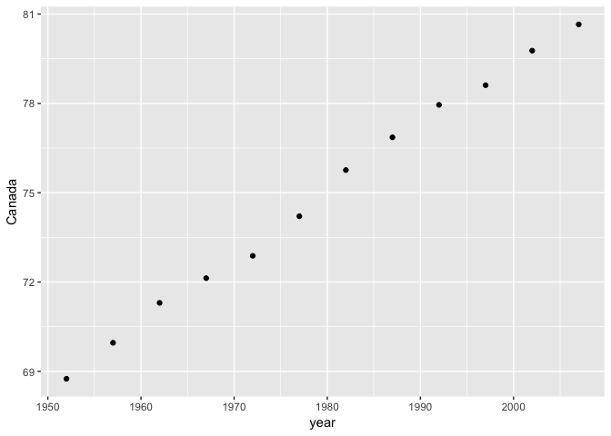
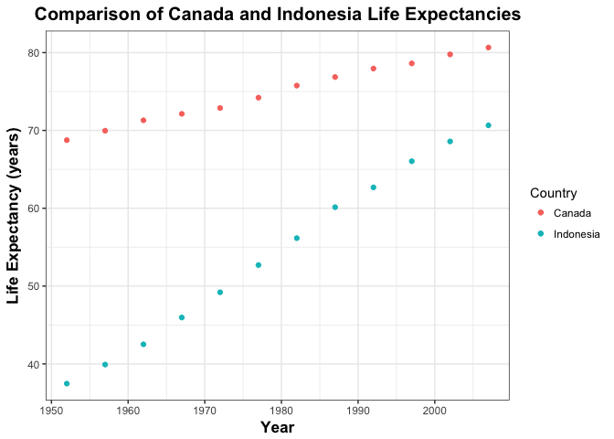

hm04\_tidy\_data\_and\_joins
================
Aisha Uduman
October 7, 2017

``` r
suppressPackageStartupMessages(library(tidyverse))
suppressPackageStartupMessages(library(gapminder))
suppressPackageStartupMessages(library(knitr))
```

General Data Reshaping and Relationship to Aggregation
------------------------------------------------------

#### Activity \#2

Make a tibble with one row per year and columns for life expectancy for two or more countries. Use knitr::kable() to make this table look pretty in your rendered homework. Take advantage of this new data shape to scatterplot life expectancy for one country against that of another.

``` r
lifeExp_year <- gapminder %>% 
  filter(country %in% c("Canada", "Bolivia", "Greece", "Tanzania", "Indonesia")) %>% 
  select(country, year, lifeExp) %>% 
  group_by(year) %>% 
  spread(key = country, value = lifeExp)
knitr::kable(lifeExp_year)
```

|  year|  Bolivia|  Canada|  Greece|  Indonesia|  Tanzania|
|-----:|--------:|-------:|-------:|----------:|---------:|
|  1952|   40.414|  68.750|  65.860|     37.468|    41.215|
|  1957|   41.890|  69.960|  67.860|     39.918|    42.974|
|  1962|   43.428|  71.300|  69.510|     42.518|    44.246|
|  1967|   45.032|  72.130|  71.000|     45.964|    45.757|
|  1972|   46.714|  72.880|  72.340|     49.203|    47.620|
|  1977|   50.023|  74.210|  73.680|     52.702|    49.919|
|  1982|   53.859|  75.760|  75.240|     56.159|    50.608|
|  1987|   57.251|  76.860|  76.670|     60.137|    51.535|
|  1992|   59.957|  77.950|  77.030|     62.681|    50.440|
|  1997|   62.050|  78.610|  77.869|     66.041|    48.466|
|  2002|   63.883|  79.770|  78.256|     68.588|    49.651|
|  2007|   65.554|  80.653|  79.483|     70.650|    52.517|

#### Scatterplot of life expectancy: Canada vs Indonesia

After forming the new dataset, I noticed right away the huge difference in life expectancies between Canada and Indonesia, especially in the 1950's-1970's. I thought this would be a good example to plot and show how life expectancies for the two countries changed over time.

``` r
lifeExp_year %>% 
  select(year, Canada, Indonesia) %>% 
  ggplot(aes(x = year, y = c(Canada))) +
         geom_point()
```


trying to plot 2 y axis: attempt \#1

``` r
ggplot(lifeExp_year, aes(year)) + 
  geom_point(aes(y = Canada, colour ="Canada")) + 
  geom_point(aes(y = Indonesia, colour="Indonesia")) + 
  labs(x = "Year", y = "Life Expectancy")
```



This plot took me a really long time - it is not like the simpler ggplots we have done before using life expectancy, as now we have to use the columns for the countries (Canada, Indonesia) and not just the general life expectancy column and select for Canada and Indonesia.

However, I think the graph shows the information pretty well: Canada has always had a relatively high life expectancy, and it has been slowly increasing with time. Indonesia, on the other hand, had a very low life expectancy of 37.5 years in 1952, but we have seen the life expectancy rise at a faster rate over time.

(this is not correct)

``` r
lifeExp_CI <- gapminder %>% 
    filter(country %in% c("Canada", "Indonesia")) %>% 
  select(country, year, lifeExp)

lifeExp_CI
```

    ## # A tibble: 24 x 3
    ##    country  year lifeExp
    ##     <fctr> <int>   <dbl>
    ##  1  Canada  1952   68.75
    ##  2  Canada  1957   69.96
    ##  3  Canada  1962   71.30
    ##  4  Canada  1967   72.13
    ##  5  Canada  1972   72.88
    ##  6  Canada  1977   74.21
    ##  7  Canada  1982   75.76
    ##  8  Canada  1987   76.86
    ##  9  Canada  1992   77.95
    ## 10  Canada  1997   78.61
    ## # ... with 14 more rows

``` r
p1 <- ggplot(lifeExp_CI, aes(year, lifeExp, colour=country))
p1
```



Join, merge, look up
--------------------

#### Activity 1

Create a second data frame, complementary to Gapminder. Join this with (part of) Gapminder using a dplyr join function and make some observations about the process and result. Explore the different types of joins. Examples of a second data frame you could build:

One row per country, a country variable and one or more variables with extra info, such as language spoken, NATO membership, national animal, or capitol city. If you really want to be helpful, you could attempt to make a pull request to resolve this issue, where I would like to bring ISO country codes into the gapminder package.

``` r
country <- c("Bangladesh","Canada","Guatemala","India","Papua New Guinea","Romania","Russia","Qatar","Somalia")
nat_animal <- c("Bengal Tiger","Beaver","Quetzal","King Cobra","Dugong","Lynx","Eurasian Brown Bear","Arabian Oryx","Leopard")
nat_language <- c("Bengali", "English, French", "Spanish", "Hindi", "Hiri Motu", "Romanian", "Russian", "Arabic", "Somali") 
activity_1 <- data.frame(country, nat_animal, nat_language)
knitr::kable(activity_1)
```

| country          | nat\_animal         | nat\_language   |
|:-----------------|:--------------------|:----------------|
| Bangladesh       | Bengal Tiger        | Bengali         |
| Canada           | Beaver              | English, French |
| Guatemala        | Quetzal             | Spanish         |
| India            | King Cobra          | Hindi           |
| Papua New Guinea | Dugong              | Hiri Motu       |
| Romania          | Lynx                | Romanian        |
| Russia           | Eurasian Brown Bear | Russian         |
| Qatar            | Arabian Oryx        | Arabic          |
| Somalia          | Leopard             | Somali          |

``` r
gapminder_2 <- gapminder %>% 
  filter(country %in% c("Bangladesh", "Canada", "Guatemala", "India", "Papua New Guinea", "Romania", "Russia", "Qatar", "Somalia")) %>% 
  group_by(country) %>% 
  summarize(mean_gdpPercap = mean(gdpPercap), mean_lifeExp = mean(lifeExp))
knitr::kable(head(gapminder_2))
```

| country    |  mean\_gdpPercap|  mean\_lifeExp|
|:-----------|----------------:|--------------:|
| Bangladesh |         817.5588|       49.83408|
| Canada     |       22410.7463|       74.90275|
| Guatemala  |        4015.4028|       56.72942|
| India      |        1057.2963|       53.16608|
| Romania    |        7300.1700|       68.29067|
| Somalia    |        1140.7933|       40.98867|

filter(country %in% c("Canada", "Bolivia", "Greece", "Tanzania", "Indonesia")) %&gt;% select(country, year, lifeExp) %&gt;% group\_by(year) %&gt;%

### Left join

The left join takes only the countries in the data from the first dataset (activity\_1) and uses the gapminder dataset to complete the information for the missing columns (e.g. pop, continent). If Gapminder does not have information for a country that is within the first dataframe, then it will populate that cell with 'NA'.

``` r
leftjoin <- left_join(activity_1, gapminder, by="country")
```

    ## Warning: Column `country` joining factors with different levels, coercing
    ## to character vector

``` r
leftjoin
```

    ##             country          nat_animal    nat_language continent year
    ## 1        Bangladesh        Bengal Tiger         Bengali      Asia 1952
    ## 2        Bangladesh        Bengal Tiger         Bengali      Asia 1957
    ## 3        Bangladesh        Bengal Tiger         Bengali      Asia 1962
    ## 4        Bangladesh        Bengal Tiger         Bengali      Asia 1967
    ## 5        Bangladesh        Bengal Tiger         Bengali      Asia 1972
    ## 6        Bangladesh        Bengal Tiger         Bengali      Asia 1977
    ## 7        Bangladesh        Bengal Tiger         Bengali      Asia 1982
    ## 8        Bangladesh        Bengal Tiger         Bengali      Asia 1987
    ## 9        Bangladesh        Bengal Tiger         Bengali      Asia 1992
    ## 10       Bangladesh        Bengal Tiger         Bengali      Asia 1997
    ## 11       Bangladesh        Bengal Tiger         Bengali      Asia 2002
    ## 12       Bangladesh        Bengal Tiger         Bengali      Asia 2007
    ## 13           Canada              Beaver English, French  Americas 1952
    ## 14           Canada              Beaver English, French  Americas 1957
    ## 15           Canada              Beaver English, French  Americas 1962
    ## 16           Canada              Beaver English, French  Americas 1967
    ## 17           Canada              Beaver English, French  Americas 1972
    ## 18           Canada              Beaver English, French  Americas 1977
    ## 19           Canada              Beaver English, French  Americas 1982
    ## 20           Canada              Beaver English, French  Americas 1987
    ## 21           Canada              Beaver English, French  Americas 1992
    ## 22           Canada              Beaver English, French  Americas 1997
    ## 23           Canada              Beaver English, French  Americas 2002
    ## 24           Canada              Beaver English, French  Americas 2007
    ## 25        Guatemala             Quetzal         Spanish  Americas 1952
    ## 26        Guatemala             Quetzal         Spanish  Americas 1957
    ## 27        Guatemala             Quetzal         Spanish  Americas 1962
    ## 28        Guatemala             Quetzal         Spanish  Americas 1967
    ## 29        Guatemala             Quetzal         Spanish  Americas 1972
    ## 30        Guatemala             Quetzal         Spanish  Americas 1977
    ## 31        Guatemala             Quetzal         Spanish  Americas 1982
    ## 32        Guatemala             Quetzal         Spanish  Americas 1987
    ## 33        Guatemala             Quetzal         Spanish  Americas 1992
    ## 34        Guatemala             Quetzal         Spanish  Americas 1997
    ## 35        Guatemala             Quetzal         Spanish  Americas 2002
    ## 36        Guatemala             Quetzal         Spanish  Americas 2007
    ## 37            India          King Cobra           Hindi      Asia 1952
    ## 38            India          King Cobra           Hindi      Asia 1957
    ## 39            India          King Cobra           Hindi      Asia 1962
    ## 40            India          King Cobra           Hindi      Asia 1967
    ## 41            India          King Cobra           Hindi      Asia 1972
    ## 42            India          King Cobra           Hindi      Asia 1977
    ## 43            India          King Cobra           Hindi      Asia 1982
    ## 44            India          King Cobra           Hindi      Asia 1987
    ## 45            India          King Cobra           Hindi      Asia 1992
    ## 46            India          King Cobra           Hindi      Asia 1997
    ## 47            India          King Cobra           Hindi      Asia 2002
    ## 48            India          King Cobra           Hindi      Asia 2007
    ## 49 Papua New Guinea              Dugong       Hiri Motu      <NA>   NA
    ## 50          Romania                Lynx        Romanian    Europe 1952
    ## 51          Romania                Lynx        Romanian    Europe 1957
    ## 52          Romania                Lynx        Romanian    Europe 1962
    ## 53          Romania                Lynx        Romanian    Europe 1967
    ## 54          Romania                Lynx        Romanian    Europe 1972
    ## 55          Romania                Lynx        Romanian    Europe 1977
    ## 56          Romania                Lynx        Romanian    Europe 1982
    ## 57          Romania                Lynx        Romanian    Europe 1987
    ## 58          Romania                Lynx        Romanian    Europe 1992
    ## 59          Romania                Lynx        Romanian    Europe 1997
    ## 60          Romania                Lynx        Romanian    Europe 2002
    ## 61          Romania                Lynx        Romanian    Europe 2007
    ## 62           Russia Eurasian Brown Bear         Russian      <NA>   NA
    ## 63            Qatar        Arabian Oryx          Arabic      <NA>   NA
    ## 64          Somalia             Leopard          Somali    Africa 1952
    ## 65          Somalia             Leopard          Somali    Africa 1957
    ## 66          Somalia             Leopard          Somali    Africa 1962
    ## 67          Somalia             Leopard          Somali    Africa 1967
    ## 68          Somalia             Leopard          Somali    Africa 1972
    ## 69          Somalia             Leopard          Somali    Africa 1977
    ## 70          Somalia             Leopard          Somali    Africa 1982
    ## 71          Somalia             Leopard          Somali    Africa 1987
    ## 72          Somalia             Leopard          Somali    Africa 1992
    ## 73          Somalia             Leopard          Somali    Africa 1997
    ## 74          Somalia             Leopard          Somali    Africa 2002
    ## 75          Somalia             Leopard          Somali    Africa 2007
    ##    lifeExp        pop  gdpPercap
    ## 1   37.484   46886859   684.2442
    ## 2   39.348   51365468   661.6375
    ## 3   41.216   56839289   686.3416
    ## 4   43.453   62821884   721.1861
    ## 5   45.252   70759295   630.2336
    ## 6   46.923   80428306   659.8772
    ## 7   50.009   93074406   676.9819
    ## 8   52.819  103764241   751.9794
    ## 9   56.018  113704579   837.8102
    ## 10  59.412  123315288   972.7700
    ## 11  62.013  135656790  1136.3904
    ## 12  64.062  150448339  1391.2538
    ## 13  68.750   14785584 11367.1611
    ## 14  69.960   17010154 12489.9501
    ## 15  71.300   18985849 13462.4855
    ## 16  72.130   20819767 16076.5880
    ## 17  72.880   22284500 18970.5709
    ## 18  74.210   23796400 22090.8831
    ## 19  75.760   25201900 22898.7921
    ## 20  76.860   26549700 26626.5150
    ## 21  77.950   28523502 26342.8843
    ## 22  78.610   30305843 28954.9259
    ## 23  79.770   31902268 33328.9651
    ## 24  80.653   33390141 36319.2350
    ## 25  42.023    3146381  2428.2378
    ## 26  44.142    3640876  2617.1560
    ## 27  46.954    4208858  2750.3644
    ## 28  50.016    4690773  3242.5311
    ## 29  53.738    5149581  4031.4083
    ## 30  56.029    5703430  4879.9927
    ## 31  58.137    6395630  4820.4948
    ## 32  60.782    7326406  4246.4860
    ## 33  63.373    8486949  4439.4508
    ## 34  66.322    9803875  4684.3138
    ## 35  68.978   11178650  4858.3475
    ## 36  70.259   12572928  5186.0500
    ## 37  37.373  372000000   546.5657
    ## 38  40.249  409000000   590.0620
    ## 39  43.605  454000000   658.3472
    ## 40  47.193  506000000   700.7706
    ## 41  50.651  567000000   724.0325
    ## 42  54.208  634000000   813.3373
    ## 43  56.596  708000000   855.7235
    ## 44  58.553  788000000   976.5127
    ## 45  60.223  872000000  1164.4068
    ## 46  61.765  959000000  1458.8174
    ## 47  62.879 1034172547  1746.7695
    ## 48  64.698 1110396331  2452.2104
    ## 49      NA         NA         NA
    ## 50  61.050   16630000  3144.6132
    ## 51  64.100   17829327  3943.3702
    ## 52  66.800   18680721  4734.9976
    ## 53  66.800   19284814  6470.8665
    ## 54  69.210   20662648  8011.4144
    ## 55  69.460   21658597  9356.3972
    ## 56  69.660   22356726  9605.3141
    ## 57  69.530   22686371  9696.2733
    ## 58  69.360   22797027  6598.4099
    ## 59  69.720   22562458  7346.5476
    ## 60  71.322   22404337  7885.3601
    ## 61  72.476   22276056 10808.4756
    ## 62      NA         NA         NA
    ## 63      NA         NA         NA
    ## 64  32.978    2526994  1135.7498
    ## 65  34.977    2780415  1258.1474
    ## 66  36.981    3080153  1369.4883
    ## 67  38.977    3428839  1284.7332
    ## 68  40.973    3840161  1254.5761
    ## 69  41.974    4353666  1450.9925
    ## 70  42.955    5828892  1176.8070
    ## 71  44.501    6921858  1093.2450
    ## 72  39.658    6099799   926.9603
    ## 73  43.795    6633514   930.5964
    ## 74  45.936    7753310   882.0818
    ## 75  48.159    9118773   926.1411

We can see that the rows for Papua New Guinea, Russia and Qatar all have NA's, implying that Gapminder does not contain data for those countries.

### Inner join

Inner join takes everything that is in common for both datasets (countries I chose + the countries available in Gapminder) and removes what isn't common.

``` r
innerjoin <- inner_join(activity_1, gapminder, by="country")
```

    ## Warning: Column `country` joining factors with different levels, coercing
    ## to character vector

``` r
innerjoin
```

    ##       country   nat_animal    nat_language continent year lifeExp
    ## 1  Bangladesh Bengal Tiger         Bengali      Asia 1952  37.484
    ## 2  Bangladesh Bengal Tiger         Bengali      Asia 1957  39.348
    ## 3  Bangladesh Bengal Tiger         Bengali      Asia 1962  41.216
    ## 4  Bangladesh Bengal Tiger         Bengali      Asia 1967  43.453
    ## 5  Bangladesh Bengal Tiger         Bengali      Asia 1972  45.252
    ## 6  Bangladesh Bengal Tiger         Bengali      Asia 1977  46.923
    ## 7  Bangladesh Bengal Tiger         Bengali      Asia 1982  50.009
    ## 8  Bangladesh Bengal Tiger         Bengali      Asia 1987  52.819
    ## 9  Bangladesh Bengal Tiger         Bengali      Asia 1992  56.018
    ## 10 Bangladesh Bengal Tiger         Bengali      Asia 1997  59.412
    ## 11 Bangladesh Bengal Tiger         Bengali      Asia 2002  62.013
    ## 12 Bangladesh Bengal Tiger         Bengali      Asia 2007  64.062
    ## 13     Canada       Beaver English, French  Americas 1952  68.750
    ## 14     Canada       Beaver English, French  Americas 1957  69.960
    ## 15     Canada       Beaver English, French  Americas 1962  71.300
    ## 16     Canada       Beaver English, French  Americas 1967  72.130
    ## 17     Canada       Beaver English, French  Americas 1972  72.880
    ## 18     Canada       Beaver English, French  Americas 1977  74.210
    ## 19     Canada       Beaver English, French  Americas 1982  75.760
    ## 20     Canada       Beaver English, French  Americas 1987  76.860
    ## 21     Canada       Beaver English, French  Americas 1992  77.950
    ## 22     Canada       Beaver English, French  Americas 1997  78.610
    ## 23     Canada       Beaver English, French  Americas 2002  79.770
    ## 24     Canada       Beaver English, French  Americas 2007  80.653
    ## 25  Guatemala      Quetzal         Spanish  Americas 1952  42.023
    ## 26  Guatemala      Quetzal         Spanish  Americas 1957  44.142
    ## 27  Guatemala      Quetzal         Spanish  Americas 1962  46.954
    ## 28  Guatemala      Quetzal         Spanish  Americas 1967  50.016
    ## 29  Guatemala      Quetzal         Spanish  Americas 1972  53.738
    ## 30  Guatemala      Quetzal         Spanish  Americas 1977  56.029
    ## 31  Guatemala      Quetzal         Spanish  Americas 1982  58.137
    ## 32  Guatemala      Quetzal         Spanish  Americas 1987  60.782
    ## 33  Guatemala      Quetzal         Spanish  Americas 1992  63.373
    ## 34  Guatemala      Quetzal         Spanish  Americas 1997  66.322
    ## 35  Guatemala      Quetzal         Spanish  Americas 2002  68.978
    ## 36  Guatemala      Quetzal         Spanish  Americas 2007  70.259
    ## 37      India   King Cobra           Hindi      Asia 1952  37.373
    ## 38      India   King Cobra           Hindi      Asia 1957  40.249
    ## 39      India   King Cobra           Hindi      Asia 1962  43.605
    ## 40      India   King Cobra           Hindi      Asia 1967  47.193
    ## 41      India   King Cobra           Hindi      Asia 1972  50.651
    ## 42      India   King Cobra           Hindi      Asia 1977  54.208
    ## 43      India   King Cobra           Hindi      Asia 1982  56.596
    ## 44      India   King Cobra           Hindi      Asia 1987  58.553
    ## 45      India   King Cobra           Hindi      Asia 1992  60.223
    ## 46      India   King Cobra           Hindi      Asia 1997  61.765
    ## 47      India   King Cobra           Hindi      Asia 2002  62.879
    ## 48      India   King Cobra           Hindi      Asia 2007  64.698
    ## 49    Romania         Lynx        Romanian    Europe 1952  61.050
    ## 50    Romania         Lynx        Romanian    Europe 1957  64.100
    ## 51    Romania         Lynx        Romanian    Europe 1962  66.800
    ## 52    Romania         Lynx        Romanian    Europe 1967  66.800
    ## 53    Romania         Lynx        Romanian    Europe 1972  69.210
    ## 54    Romania         Lynx        Romanian    Europe 1977  69.460
    ## 55    Romania         Lynx        Romanian    Europe 1982  69.660
    ## 56    Romania         Lynx        Romanian    Europe 1987  69.530
    ## 57    Romania         Lynx        Romanian    Europe 1992  69.360
    ## 58    Romania         Lynx        Romanian    Europe 1997  69.720
    ## 59    Romania         Lynx        Romanian    Europe 2002  71.322
    ## 60    Romania         Lynx        Romanian    Europe 2007  72.476
    ## 61    Somalia      Leopard          Somali    Africa 1952  32.978
    ## 62    Somalia      Leopard          Somali    Africa 1957  34.977
    ## 63    Somalia      Leopard          Somali    Africa 1962  36.981
    ## 64    Somalia      Leopard          Somali    Africa 1967  38.977
    ## 65    Somalia      Leopard          Somali    Africa 1972  40.973
    ## 66    Somalia      Leopard          Somali    Africa 1977  41.974
    ## 67    Somalia      Leopard          Somali    Africa 1982  42.955
    ## 68    Somalia      Leopard          Somali    Africa 1987  44.501
    ## 69    Somalia      Leopard          Somali    Africa 1992  39.658
    ## 70    Somalia      Leopard          Somali    Africa 1997  43.795
    ## 71    Somalia      Leopard          Somali    Africa 2002  45.936
    ## 72    Somalia      Leopard          Somali    Africa 2007  48.159
    ##           pop  gdpPercap
    ## 1    46886859   684.2442
    ## 2    51365468   661.6375
    ## 3    56839289   686.3416
    ## 4    62821884   721.1861
    ## 5    70759295   630.2336
    ## 6    80428306   659.8772
    ## 7    93074406   676.9819
    ## 8   103764241   751.9794
    ## 9   113704579   837.8102
    ## 10  123315288   972.7700
    ## 11  135656790  1136.3904
    ## 12  150448339  1391.2538
    ## 13   14785584 11367.1611
    ## 14   17010154 12489.9501
    ## 15   18985849 13462.4855
    ## 16   20819767 16076.5880
    ## 17   22284500 18970.5709
    ## 18   23796400 22090.8831
    ## 19   25201900 22898.7921
    ## 20   26549700 26626.5150
    ## 21   28523502 26342.8843
    ## 22   30305843 28954.9259
    ## 23   31902268 33328.9651
    ## 24   33390141 36319.2350
    ## 25    3146381  2428.2378
    ## 26    3640876  2617.1560
    ## 27    4208858  2750.3644
    ## 28    4690773  3242.5311
    ## 29    5149581  4031.4083
    ## 30    5703430  4879.9927
    ## 31    6395630  4820.4948
    ## 32    7326406  4246.4860
    ## 33    8486949  4439.4508
    ## 34    9803875  4684.3138
    ## 35   11178650  4858.3475
    ## 36   12572928  5186.0500
    ## 37  372000000   546.5657
    ## 38  409000000   590.0620
    ## 39  454000000   658.3472
    ## 40  506000000   700.7706
    ## 41  567000000   724.0325
    ## 42  634000000   813.3373
    ## 43  708000000   855.7235
    ## 44  788000000   976.5127
    ## 45  872000000  1164.4068
    ## 46  959000000  1458.8174
    ## 47 1034172547  1746.7695
    ## 48 1110396331  2452.2104
    ## 49   16630000  3144.6132
    ## 50   17829327  3943.3702
    ## 51   18680721  4734.9976
    ## 52   19284814  6470.8665
    ## 53   20662648  8011.4144
    ## 54   21658597  9356.3972
    ## 55   22356726  9605.3141
    ## 56   22686371  9696.2733
    ## 57   22797027  6598.4099
    ## 58   22562458  7346.5476
    ## 59   22404337  7885.3601
    ## 60   22276056 10808.4756
    ## 61    2526994  1135.7498
    ## 62    2780415  1258.1474
    ## 63    3080153  1369.4883
    ## 64    3428839  1284.7332
    ## 65    3840161  1254.5761
    ## 66    4353666  1450.9925
    ## 67    5828892  1176.8070
    ## 68    6921858  1093.2450
    ## 69    6099799   926.9603
    ## 70    6633514   930.5964
    ## 71    7753310   882.0818
    ## 72    9118773   926.1411

The Gapminder dataset does not have data for the countries Papua New Guinea, Russia or Qatar. This is why there are 3 less rows than the `left_join` output (72 rows versus 75).

#### One row per continent, a continent variable and one or more variables with extra info, such as northern versus southern hemisphere.

I decided to use the variable population, and created a dataframe with one row per continent and their average population in the year 2007.

``` r
pop2007 <- gapminder %>% 
  filter(year==2007) %>% 
  group_by(continent) %>% 
  summarise(Average_Population=mean(pop))
pop2007
```

    ## # A tibble: 5 x 2
    ##   continent Average_Population
    ##      <fctr>              <dbl>
    ## 1    Africa           17875763
    ## 2  Americas           35954847
    ## 3      Asia          115513752
    ## 4    Europe           19536618
    ## 5   Oceania           12274974

I then had to make a dataframe for continent variables (west or east of Atlantic Ocean) - this is kind of silly in my opinion but I couldn't think of many suitable continent-wide variables where continents weren't cut off in some places.

``` r
atlantic_ocean <- c("East", "West", "East", "West", "West")
continent <- c("Africa", "Americas", "Asia", "Europe", "Oceania")

ocean <- data.frame(continent, atlantic_ocean)
knitr::kable(ocean)
```

| continent | atlantic\_ocean |
|:----------|:----------------|
| Africa    | East            |
| Americas  | West            |
| Asia      | East            |
| Europe    | West            |
| Oceania   | West            |

Now we join this new dataframe with the continent variable with the gapminder dataset we made before summarizing continent by average population in the year of 2007:

``` r
innerjoin2 <- inner_join(pop2007, ocean, by="continent")
knitr::kable(innerjoin2)
```

| continent |  Average\_Population| atlantic\_ocean |
|:----------|--------------------:|:----------------|
| Africa    |             17875763| East            |
| Americas  |             35954847| West            |
| Asia      |            115513752| East            |
| Europe    |             19536618| West            |
| Oceania   |             12274974| West            |

How do I add 2 national languages to certain countries? YES - put it inside the parentheses for the languages. However, this becomes a problem if I need to filter (i.e. I would need to filter by "English,""", "English, French"" or """, French""). I'm not sure if there's an easier way to do this, maybe add another column for other national languages? But there are some countries like South Africa that have 11 national languages - I'm interested in seeing if there is a way around this. Join two datasets with different levels

Reporting my process
--------------------

Spread function: <https://stackoverflow.com/questions/26221752/how-spread-in-tidyr-handles-factor-levels>

Getting my left join to work took a while at first.
