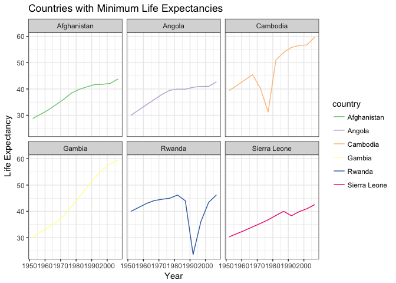
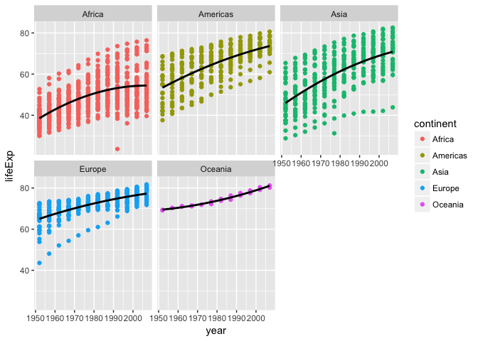
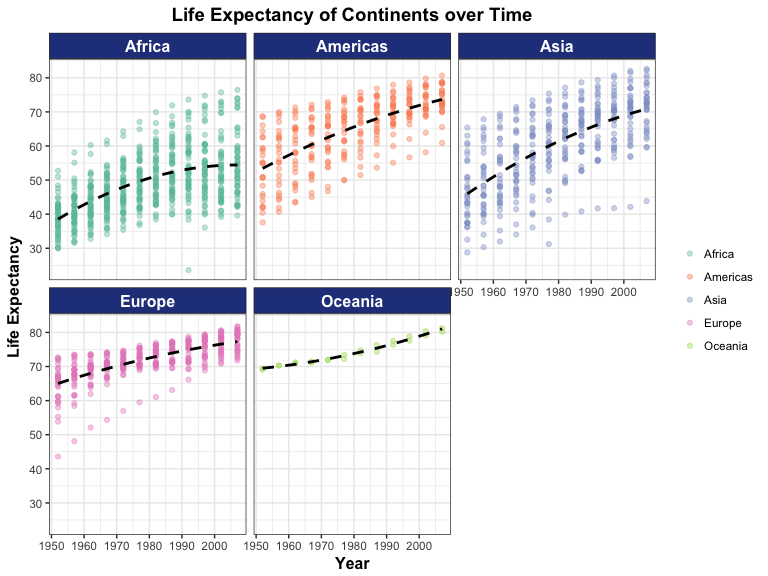

Factor Management
=================

The goals for this homework:

-   Define factor variables
-   Drop factor/levels
-   Reorder levels based on knowledge from data

### Gapminder version:

I decided to stick with the Gapminder dataset as I find it much easier to use intuitively (especially the column names) compared to the Singer database, and also because this part of the class is getting to be a bit over my head at times, so keeping it simple is key :ok\_hand:

**Drop Oceania**

First let's see the summary for Gapminder:

``` r
summary(gapminder)
```

    ##         country        continent        year         lifeExp     
    ##  Afghanistan:  12   Africa  :624   Min.   :1952   Min.   :23.60  
    ##  Albania    :  12   Americas:300   1st Qu.:1966   1st Qu.:48.20  
    ##  Algeria    :  12   Asia    :396   Median :1980   Median :60.71  
    ##  Angola     :  12   Europe  :360   Mean   :1980   Mean   :59.47  
    ##  Argentina  :  12   Oceania : 24   3rd Qu.:1993   3rd Qu.:70.85  
    ##  Australia  :  12                  Max.   :2007   Max.   :82.60  
    ##  (Other)    :1632                                                
    ##       pop              gdpPercap       
    ##  Min.   :6.001e+04   Min.   :   241.2  
    ##  1st Qu.:2.794e+06   1st Qu.:  1202.1  
    ##  Median :7.024e+06   Median :  3531.8  
    ##  Mean   :2.960e+07   Mean   :  7215.3  
    ##  3rd Qu.:1.959e+07   3rd Qu.:  9325.5  
    ##  Max.   :1.319e+09   Max.   :113523.1  
    ## 

``` r
nrow(gapminder)
```

    ## [1] 1704

``` r
levels(gapminder$continent)
```

    ## [1] "Africa"   "Americas" "Asia"     "Europe"   "Oceania"

We can see that Gapminder originally has 5 continents and 1704 rows, 24 rows being associated with Oceania. Now I'm filtering by continent, to exclude Oceania.

``` r
gap_noocean <- gapminder %>% 
  filter(continent != "Oceania")
```

Checking to see if Oceania has been dropped: We can see that now Oceania has 0 values, but *still shows up in the summary for this new dataframe.*

``` r
summary(gap_noocean)
```

    ##         country        continent        year         lifeExp     
    ##  Afghanistan:  12   Africa  :624   Min.   :1952   Min.   :23.60  
    ##  Albania    :  12   Americas:300   1st Qu.:1966   1st Qu.:48.08  
    ##  Algeria    :  12   Asia    :396   Median :1980   Median :60.34  
    ##  Angola     :  12   Europe  :360   Mean   :1980   Mean   :59.26  
    ##  Argentina  :  12   Oceania :  0   3rd Qu.:1993   3rd Qu.:70.75  
    ##  Austria    :  12                  Max.   :2007   Max.   :82.60  
    ##  (Other)    :1608                                                
    ##       pop              gdpPercap       
    ##  Min.   :6.001e+04   Min.   :   241.2  
    ##  1st Qu.:2.780e+06   1st Qu.:  1189.1  
    ##  Median :7.024e+06   Median :  3449.5  
    ##  Mean   :2.990e+07   Mean   :  7052.4  
    ##  3rd Qu.:1.987e+07   3rd Qu.:  8943.2  
    ##  Max.   :1.319e+09   Max.   :113523.1  
    ## 

We need to remove Oceania from this dataframe altogether. To do so, I used the `droplevels()` argument, to drop the unused levels:

``` r
gap_noocean_drop <- gap_noocean %>%
  droplevels()

nlevels(gap_noocean_drop$continent)
```

    ## [1] 4

``` r
summary(gap_noocean_drop)
```

    ##         country        continent        year         lifeExp     
    ##  Afghanistan:  12   Africa  :624   Min.   :1952   Min.   :23.60  
    ##  Albania    :  12   Americas:300   1st Qu.:1966   1st Qu.:48.08  
    ##  Algeria    :  12   Asia    :396   Median :1980   Median :60.34  
    ##  Angola     :  12   Europe  :360   Mean   :1980   Mean   :59.26  
    ##  Argentina  :  12                  3rd Qu.:1993   3rd Qu.:70.75  
    ##  Austria    :  12                  Max.   :2007   Max.   :82.60  
    ##  (Other)    :1608                                                
    ##       pop              gdpPercap       
    ##  Min.   :6.001e+04   Min.   :   241.2  
    ##  1st Qu.:2.780e+06   1st Qu.:  1189.1  
    ##  Median :7.024e+06   Median :  3449.5  
    ##  Mean   :2.990e+07   Mean   :  7052.4  
    ##  3rd Qu.:1.987e+07   3rd Qu.:  8943.2  
    ##  Max.   :1.319e+09   Max.   :113523.1  
    ## 

Now we can see that Oceania no longer exists within the continent variable, and the number of levels within this variable is 4 (as opposed to 5 in the original gapminder). Since Oceania was associated with 24 rows in the original Gapminder, we should now see this new dataframe having 24 less rows:

``` r
nrow(gap_noocean_drop)
```

    ## [1] 1680

1704 - 1680 = 24. Yay!

Just to confirm that only 4 continents are present:

``` r
levels(gap_noocean_drop$continent)
```

    ## [1] "Africa"   "Americas" "Asia"     "Europe"

Great, Oceania no longer exists in this new dataframe!

**Reorder the levels of `country` or `continent`**

Reordering countries based on ascending life expectancies:

``` r
fct_reorder(gap_noocean_drop$country, gap_noocean_drop$lifeExp) %>% 
  levels()
```

    ##   [1] "Sierra Leone"             "Guinea-Bissau"           
    ##   [3] "Afghanistan"              "Angola"                  
    ##   [5] "Somalia"                  "Guinea"                  
    ##   [7] "Niger"                    "Mozambique"              
    ##   [9] "Liberia"                  "Mali"                    
    ##  [11] "Equatorial Guinea"        "Gambia"                  
    ##  [13] "Rwanda"                   "Central African Republic"
    ##  [15] "Eritrea"                  "Malawi"                  
    ##  [17] "Ethiopia"                 "Burundi"                 
    ##  [19] "Nigeria"                  "Congo, Dem. Rep."        
    ##  [21] "Zambia"                   "Yemen, Rep."             
    ##  [23] "Burkina Faso"             "Djibouti"                
    ##  [25] "Madagascar"               "Swaziland"               
    ##  [27] "Cote d'Ivoire"            "Nepal"                   
    ##  [29] "Cambodia"                 "Uganda"                  
    ##  [31] "Chad"                     "Bangladesh"              
    ##  [33] "Tanzania"                 "Sudan"                   
    ##  [35] "Lesotho"                  "Cameroon"                
    ##  [37] "Benin"                    "Senegal"                 
    ##  [39] "Haiti"                    "Comoros"                 
    ##  [41] "Bolivia"                  "Mauritania"              
    ##  [43] "Ghana"                    "Botswana"                
    ##  [45] "Zimbabwe"                 "Namibia"                 
    ##  [47] "South Africa"             "Kenya"                   
    ##  [49] "Congo, Rep."              "Togo"                    
    ##  [51] "Indonesia"                "Egypt"                   
    ##  [53] "Gabon"                    "Pakistan"                
    ##  [55] "India"                    "Mongolia"                
    ##  [57] "Myanmar"                  "Guatemala"               
    ##  [59] "Vietnam"                  "El Salvador"             
    ##  [61] "Morocco"                  "Iraq"                    
    ##  [63] "Nicaragua"                "Iran"                    
    ##  [65] "Honduras"                 "Sao Tome and Principe"   
    ##  [67] "Algeria"                  "Libya"                   
    ##  [69] "Peru"                     "Oman"                    
    ##  [71] "Turkey"                   "Saudi Arabia"            
    ##  [73] "Philippines"              "Tunisia"                 
    ##  [75] "Brazil"                   "Jordan"                  
    ##  [77] "West Bank and Gaza"       "Dominican Republic"      
    ##  [79] "Ecuador"                  "Syria"                   
    ##  [81] "Thailand"                 "China"                   
    ##  [83] "Colombia"                 "Mauritius"               
    ##  [85] "Korea, Rep."              "Mexico"                  
    ##  [87] "Lebanon"                  "Paraguay"                
    ##  [89] "Malaysia"                 "Korea, Dem. Rep."        
    ##  [91] "Bahrain"                  "Sri Lanka"               
    ##  [93] "Venezuela"                "Reunion"                 
    ##  [95] "Trinidad and Tobago"      "Chile"                   
    ##  [97] "Argentina"                "Romania"                 
    ##  [99] "Hungary"                  "Panama"                  
    ## [101] "Albania"                  "Uruguay"                 
    ## [103] "Serbia"                   "Bosnia and Herzegovina"  
    ## [105] "Kuwait"                   "Croatia"                 
    ## [107] "Jamaica"                  "Czech Republic"          
    ## [109] "Bulgaria"                 "Slovak Republic"         
    ## [111] "Poland"                   "Slovenia"                
    ## [113] "Singapore"                "Taiwan"                  
    ## [115] "Portugal"                 "Costa Rica"              
    ## [117] "Ireland"                  "Austria"                 
    ## [119] "Germany"                  "Cuba"                    
    ## [121] "Belgium"                  "United Kingdom"          
    ## [123] "Montenegro"               "Finland"                 
    ## [125] "Puerto Rico"              "Israel"                  
    ## [127] "United States"            "Italy"                   
    ## [129] "France"                   "Greece"                  
    ## [131] "Hong Kong, China"         "Denmark"                 
    ## [133] "Canada"                   "Spain"                   
    ## [135] "Norway"                   "Netherlands"             
    ## [137] "Switzerland"              "Sweden"                  
    ## [139] "Japan"                    "Iceland"

Reordering continents based on descending variance in GDP per capita:

``` r
fct_reorder(gap_noocean_drop$continent, gap_noocean_drop$gdpPercap, var, .desc = TRUE) %>% 
  levels()
```

    ## [1] "Asia"     "Europe"   "Americas" "Africa"

For a more focussed example, let's look at the variable life expectancy, focusing on the countries with the lowest life expectancies. I used `head`() to identify the 6 countries with lowest life expectancies.

``` r
country_reorder_lifeExp <- fct_reorder(gap_noocean_drop$country, gap_noocean_drop$lifeExp, min, .desc = FALSE) %>% 
  levels() %>% 
  head()

head(country_reorder_lifeExp)
```

    ## [1] "Rwanda"       "Afghanistan"  "Gambia"       "Angola"      
    ## [5] "Sierra Leone" "Cambodia"

We can see that now that the reordering has been done, Rwanda, Afghanistan, Gambia, Angola, Sierra Leone and Cambodia have the lowest life expectancies in the gapminder dataframe.

Now I want to define the life expectancies as a dataframe with only the country, year and its corresponding life expectancy to see if it's changing over time: This will get rid of the population, continent, and GDP per capita factors.

``` r
min_lifeExp <- gap_noocean_drop %>% 
  filter(country %in% country_reorder_lifeExp) %>% 
  select(year, country, lifeExp)
```

We can plot this to visualize the differences and trends over time:

``` r
plot_minlifeExp <- ggplot(min_lifeExp, aes(year, lifeExp, colour=country)) + 
  facet_wrap(~country) + 
  geom_line() + 
  scale_color_brewer(palette="Accent") + 
  labs(x = "Year", y = "Life Expectancy", title = "Countries with Minimum Life Expectancies") + theme_bw()
plot_minlifeExp
```


Cool, now we can see the output of our reordered factors selecting for minimum life expectancy.

Common Part
===========

Characterize the derived data before and after your factor re-leveling.

**Exploring effects of reordering a factor and factor reordering coupled with `arrange()`.**

To see how our countries are organized (most likely alphebetically):

``` r
min_lifeExp %>% 
  group_by(country)
```

    ## # A tibble: 72 x 3
    ## # Groups:   country [6]
    ##     year     country lifeExp
    ##    <int>      <fctr>   <dbl>
    ##  1  1952 Afghanistan  28.801
    ##  2  1957 Afghanistan  30.332
    ##  3  1962 Afghanistan  31.997
    ##  4  1967 Afghanistan  34.020
    ##  5  1972 Afghanistan  36.088
    ##  6  1977 Afghanistan  38.438
    ##  7  1982 Afghanistan  39.854
    ##  8  1987 Afghanistan  40.822
    ##  9  1992 Afghanistan  41.674
    ## 10  1997 Afghanistan  41.763
    ## # ... with 62 more rows

Yes, the countries are arranged alphabetically. I want them to be displayed in terms of minimum life expectancy, so the dataframe must be re-arranged to display life expectancy levels in ascending order. \*This is a note to myself, if I wanted to arrange by descending order I would use `arrange(desc(lifeExp))`, as `arrange()` automatically uses ascending order.

``` r
ascending_lifeExp <- min_lifeExp %>% 
  group_by(country) %>% 
  arrange(lifeExp)
```

To view only the first 15 rows of this also very long dataset, I used the `head()` function:

``` r
head(ascending_lifeExp, 15) %>% 
kable()
```

|  year| country      |  lifeExp|
|-----:|:-------------|--------:|
|  1992| Rwanda       |   23.599|
|  1952| Afghanistan  |   28.801|
|  1952| Gambia       |   30.000|
|  1952| Angola       |   30.015|
|  1952| Sierra Leone |   30.331|
|  1957| Afghanistan  |   30.332|
|  1977| Cambodia     |   31.220|
|  1957| Sierra Leone |   31.570|
|  1962| Afghanistan  |   31.997|
|  1957| Angola       |   31.999|
|  1957| Gambia       |   32.065|
|  1962| Sierra Leone |   32.767|
|  1962| Gambia       |   33.896|
|  1962| Angola       |   34.000|
|  1967| Afghanistan  |   34.020|

This is what I wanted, now we can see our dataframe is sorted in terms of increasing life expectancy, and not country or year. Does arranging the data have any effect on a figure?

``` r
ggplot(ascending_lifeExp, aes(year, lifeExp, colour=country)) + 
  facet_wrap(~country) + 
  geom_line() + 
  scale_color_brewer(palette="Accent") + 
  labs(x = "Year", y = "Life Expectancy", title = "Countries with Minimum Life Expectancies") + theme_bw()
```


It doesn't seem like this has any effect on a graph.

**Exploring the effects of reordering a factor and factor reordering coupled with `arrange()`**

I want to see if coupling the factor reordering with `arrange()` has any effect on a figure:

With `arrange()`:

``` r
ggplot(ascending_lifeExp, aes(year, lifeExp, colour=country)) + 
  facet_wrap(~country) + 
  geom_line() + 
  scale_color_brewer(palette="Accent") + 
  labs(x = "Year", y = "Life Expectancy", title = "Countries with Minimum Life Expectancies") + theme_bw()
```



Without \`arrange():

``` r
plot_minlifeExp <- ggplot(min_lifeExp, aes(year, lifeExp, colour=country)) + 
  facet_wrap(~country) + 
  geom_line() + 
  scale_color_brewer(palette="Accent") + 
  labs(x = "Year", y = "Life Expectancy", title = "Countries with Minimum Life Expectancies") + theme_bw()
plot_minlifeExp
```


No, unless I'm doing it wrong...the visualizations are exactly the same! Even the countries in the legend are still in alphabetical order. I played around with this for a long time and found that nothing I did with `arrange()` made a change in the resulting plot.

Visualization design
====================

I think it will be interesting to take one of the first (slightly complex) plots I ever made in ggplot, which is probably hideous, and try and work on it to make it look more visually pleasing after learning a lot about visualization techniques in this class. This is an initial plot of

``` r
ggplot(gapminder, aes(year, lifeExp, colour = continent)) +
    facet_wrap(~ continent) +
    geom_point() + 
  geom_smooth(method='loess', colour = "black", se=FALSE, span = 5) 
```



Now to make it look nicer: I adjusted the figure height and width, changed the alpha transparency to 0.4, made the line dashed. I enjoyed manually selecting colours, however I know I'm not an expert so I decided to use one of the R Colour Brewer palettes for qualitative data....to be honest I really don't like any of them, but "Set2" seemed okay.

In addition, I also used `labs` and `theme` to adjust the axis title, positions, font sizes, the strip background colour and text colour, removed the legend title as I think it's pretty self-explanatory. I also used the `scales::pretty_breaks` argument to adjust the y-axis as I found ticks representing 20 years of age not to be super helpful.

``` r
ggplot(gapminder, aes(year, lifeExp, colour = continent)) +
    facet_wrap(~ continent) +
    geom_point(alpha=0.4) + 
  scale_y_continuous(breaks = scales::pretty_breaks(n = 7)) + 
  geom_smooth(method='loess', colour = "black", se=FALSE, span = 5, linetype = "dashed") +
  labs(x = "Year", y = "Life Expectancy", title = "Life Expectancy of Continents over Time") + 
  scale_color_brewer(palette = "Set2") + 
  theme_bw() +
    theme(strip.background = element_rect(fill="royalblue4"), 
          strip.text = element_text(size=12, face="bold", colour = "white"), 
          plot.title = element_text(size=14,face="bold", hjust = 0.5),
          axis.title = element_text(size=12, face="bold"), 
          legend.title = element_blank())
```



File I/O
========

Writing and reading to file

**Writing:**

``` r
write.csv(ascending_lifeExp, file = "ascending_lifeExp.csv")
```

I can see that the .csv file shows up in the homework 5 folder.

**Reading:**

Now to read the .csv file I just wrote, I will use the `read_csv` function. I also used the `head()` function again to only show the first 15 rows to save space.

``` r
read_csv_asc <- read_csv("ascending_lifeExp.csv")
```

    ## Warning: Missing column names filled in: 'X1' [1]

    ## Parsed with column specification:
    ## cols(
    ##   X1 = col_integer(),
    ##   year = col_integer(),
    ##   country = col_character(),
    ##   lifeExp = col_double()
    ## )

``` r
head(read_csv_asc, 15) %>% 
kable(digits=2)
```

|   X1|  year| country      |  lifeExp|
|----:|-----:|:-------------|--------:|
|    1|  1992| Rwanda       |    23.60|
|    2|  1952| Afghanistan  |    28.80|
|    3|  1952| Gambia       |    30.00|
|    4|  1952| Angola       |    30.02|
|    5|  1952| Sierra Leone |    30.33|
|    6|  1957| Afghanistan  |    30.33|
|    7|  1977| Cambodia     |    31.22|
|    8|  1957| Sierra Leone |    31.57|
|    9|  1962| Afghanistan  |    32.00|
|   10|  1957| Angola       |    32.00|
|   11|  1957| Gambia       |    32.06|
|   12|  1962| Sierra Leone |    32.77|
|   13|  1962| Gambia       |    33.90|
|   14|  1962| Angola       |    34.00|
|   15|  1967| Afghanistan  |    34.02|

It works, I can write a .csv file and pull it up again.

Writing Figures to File
=======================

Using `ggsave`, I will save a plot made earlier in this homework:

``` r
ggsave("MinLifeExpPlot.pdf", plot_minlifeExp, width = 8, height = 6)
```

I played around a bit with figure height and width. After running, I noticed the .pdf immediately appearing in my homework 5 folder, found 

I'll try saving a plot object made from homework 3:

``` r
p <- ggplot(gapminder %>% 
  group_by(continent,year) %>% 
  summarise(mean_lifeExp=mean(lifeExp)), 
  aes(year, mean_lifeExp, group=continent, colour=continent)) + 
  geom_smooth(method="loess", se=FALSE) + 
  scale_colour_manual(values=c("darkslateblue", "olivedrab", "tan3", "orangered3", "maroon4")) +
  labs(x = "Year", y = "Life Expectancy", title = "Life Expectancy Over Time for the Continents") + 
  theme(axis.title = element_text(size=14),
        axis.text.x = element_text(size=12),
        axis.text.y = element_text(size=12),
        plot.title = element_text(size=16, hjust = 0.5))
```

``` r
ggsave("my_plot.pdf", p)
```

    ## Saving 7 x 5 in image

I can see that this created another plot in my homework 5 folder, which can be found . To be honest, I can't think of when this actually matters compared to the previous `ggsave` function I ran before. I have to read up about this more.

Reporting my Progress
=====================

I found this week's homework to take quite a bit of time - I was also rushed due to my TA commitments and a trip I had to take on the weekend. The actual work took quite a long time so I wasn't able to spend as much time as I would have liked on the aesthetics of the output.

**Some issues I encountered:**

-   I spent too long trying to make sure I only selected a few of the countries with lowest expectancy, and realised instead of using `head()` to view them and then manually select them like I've been doing before, I can just pipe `head()` after the `levels()` argument to only retain the first 6 levels that I want to visualize.

-   I had issues figuring out how to enter my pathway to save my csv files....using the `file=""` I realised it saves automatically to the folder that this markdown file is in (so my homework 5 folder), but what if I wanted to save it somewhere else? I kept getting error messages, so need to look into that later.

-   I would like to learn how to display two plots side by side (i.e. if I could show the plots of factor reordering and factor reordering + `arrange()`) it would look much better and also be easier to notice any differences. I noticed Vincenzo posted [this](http://stat545.com/block020_multiple-plots-on-a-page.html) link, however I ran out of time to try it.

**Useful Links**

-   Helpful information on [`arrange()`](https://www.r-bloggers.com/dplyr-example-1/)

-   A useful forum on using `scales::pretty_breaks(n=)` to change the number of [axis ticks.](https://stackoverflow.com/questions/11335836/increase-number-of-axis-ticks)

-   [ggplot2](http://sape.inf.usi.ch/quick-reference/ggplot2/colour) quick reference for colour and fill.

-   Notes from STAT 545 class on ['being the boss of your factors'](http://stat545.com/block029_factors.html) were super useful to keep wrapping my head around these concepts.
